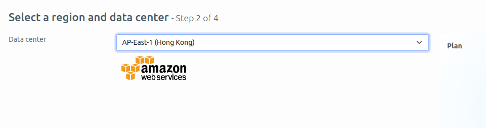
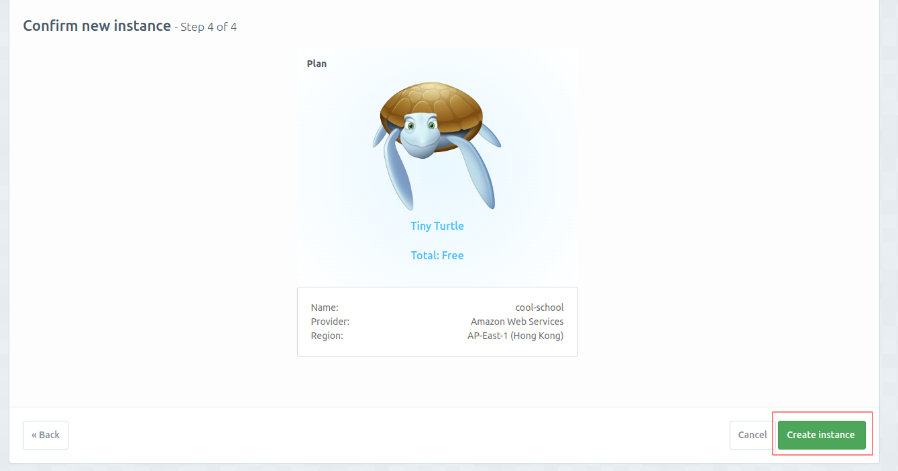
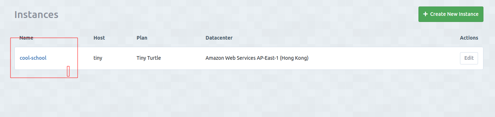
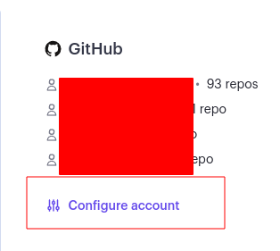
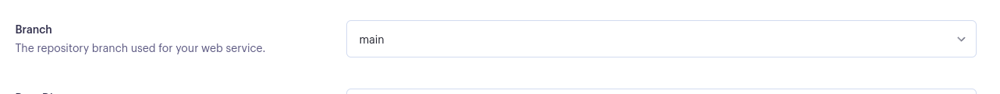
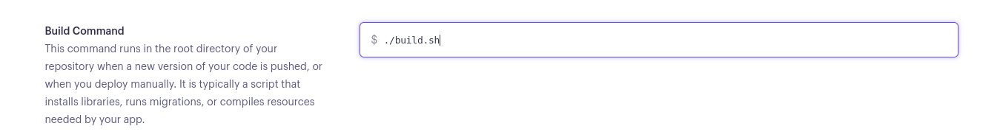
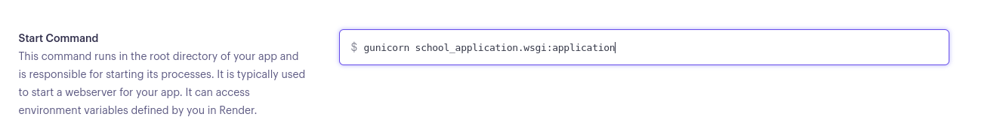

# Deployment

- The app was deployed to [Render](https://render.com/).
- The database was deployed to [ElephantSQL](https://www.elephantsql.com/).

- The app can be reached by the [link](https://cool-school.onrender.com).

## Local deployment

*Note:*
  - This project requires to install all the requirements:
  - Open the terminal window and type:
  - `pip3 install -r requirements.txt`

Create a local copy of the GitHub repository by following one of the two processes below:

- Download ZIP file:
  1. Go to the [GitHub Repo page](https://github.com/IuliiaKonovalova/issue_tracker).
  1. Click the Code button and download the ZIP file containing the project.
  1. Extract the ZIP file to a location on your PC.

- Clone the repository:
  1. Open a folder on your computer with the terminal.
  1. Run the following command
  - `git clone https://github.com/IuliiaKonovalova/issue_tracker.git`

- Alternatively, if using Gitpod, you can click below to create your own workspace using this repository.

  [](https://gitpod.io/#https://github.com/IuliiaKonovalova/issue_tracker)

---

1. Install the dependencies:

    - Open the terminal window and type:
    - `pip3 install -r requirements.txt`


1. Create a `.gitignore` file in the root directory of the project where you should add env.py and __pycache__ files to prevent the privacy of your secret data.

1. Create a `.env` file. This will contain the following environment variables:

    ```python
    import os

      os.environ['SECRET_KEY'] = 'Add a secret key'
      os.environ['DATABASE_URL'] = 'will be used to connect to the database'
      os.environ['DEBUG'] = 'True'
    ```

    *During the development stage DEBUG is set to True, but it is vital to change it to False.*

1. Run the following commands in a terminal to make migrations: 
    - `python3 manage.py makemigrations`
    - `python3 manage.py migrate`
1. Create a superuser to get access to the admin environment.
    - `python3 manage.py createsuperuser`
    - Enter the required information (your username, email and password).
1. Run the app with the following command in the terminal:
    - `python3 manage.py runserver`
1. Open the link provided in a browser to see the app.

1. If you need to access the admin page:
    - Add /admin/ to the link provided.
    - Enter your username and password (for the superuser that you have created before).
    - You will be redirected to the admin page.


**The app was initially deployed to Heroku then moved to Render since Heroku has removed its free tier services from November 29 2022**

## Heroku Deployment

* Set up a local workspace on your computer for Heroku:
    - Create a list of requirements that the project needs to run:
      - type this in the terminal: `pip3 freeze > requirements.txt`
    - Commit and push the changes to GitHub
    
* Go to [www.heroku.com](www.heroku.com) 
* Log in or create a Heroku account.
* Create a new app with any unique name <name app>.

  

* Create a Procfile in your local workplace:

  
    
    This file will will contain the following:
    ```python
        web: gunicorn <name app>.wsgi:application
    ```
    - Commit and push the changes to GitHub.

* Go to resources in Heroku and search for postgresql. Select Hobby dev - Free and click on the provision button to add it to the project.

  

* Go to the settings app in Heroku and go to Config Vars.

  

Click on Reveal Config Vars and add the following config variables:

| Key      | Value          |
|-------------|-------------|
| DATABASE_URL | ... | 
| DISABLE_COLLECTSTATIC | 1 |
| EMAIL_HOST_PASS | ... |
| EMAIL_HOST_USER | ... |
| HEROKU_HOSTNAME | ... |
| SECRET_KEY | ... |


* Copy the value of DATABASE_URL and input it into the .env file and generate a secret key (you may use [Djecrety](https://djecrety.ir/) for secret key generation).
* Create EMAIL_HOST_PASS and EMAIL_HOST_USER with a gmail account and add values to these keys.
* Migrate changes.
* Set debug to False in settings.py
* Commit and push the changes to GitHub.
* Connect your repository to Heroku.

  

* Deploy the app to Heroku by clicking "Deploy Branch" button. If you want to enable auto-deployment, click "Enable Automatic Deployment".

   


The deployment process will start.

   

Click "View build logs" to see the progress of the deployment.

  


*Due to security updates, Heroku dashboard will not allow you to deploy your app from GitHub. Thus, you need to run the following commands in your terminal:*

| action | terminal command | comment |
| ------ | ---------------- | ------- |
| login to your heroku account | `heroku login -i` | |
| create a new app on heroku | `heroku create NAME-OF-YOUR-APP` | if you haven't created the app before, and then, you can access the app via the Heroku dashboard and set up your config vars.|
| add remote to your local repository | `heroku git:remote -a NAME-OF-YOUR-APP` | if you have already created app on Heroku (before the security updates) and connected it using Heroku dashboard |
| deploy new version of the app | `git push heroku main` | |
| rename app | `git remote rename NAME-OF-YOUR-APP NAME-OF-YOUR-APP-2` | |

**Final Deployment**

* Set debug to False locally + delete DISABLE_COLLECTSTATIC from config vars in Heroku dashboard.
* Commit and push the changes to GitHub.

## Render Deployment

### Create Database on ElephantSQL

1. Go to [ElephantSQL](https://www.elephantsql.com/) and create a new account.

2. Create a new instance of the database.

    - 

3. Select a name for your database and select the free plan.

    - 

4. Click "Select Region"

    - 

5. Select a region close to you.

    - 

6. Click "Review"

    - 

7. Click "Create Instance"

    - 

8. Click on the name of your database to open the dashboard.

    - 

9. You will see the dashboard of your database. You will need the URL of your database to connect it to your Django project.

    - 

### Create a new app on Render

Link to the deployed application on Render: [Cool School](https://cool-school.onrender.com/)

1. Create a new Render account if you don't already have one here [Render](https://render.com/).

2. Create a new application on the following page here [New Render App](https://dashboard.render.com/), choose **Webserver**:

    - 

3. Select the GitHub option and connect the application to the repository you created.

    - 

4. Search for the repository you created and click "Connect."

    - 

    - 

5. Create name for the application

    - 

6. Select the region where you want to deploy the application.

    - 

7. Select branch to deploy.

    - 

8. Select environment.

    - 

9. Render build command: `./build.sh`

    - 

10. Render start command: `gunicorn <NAME OF YOUR APP>.wsgi:application` + You can delete `Procfile` from your repository.

    - 

11. Select Free plan.

    - 

12. Click on "Advanced" settings.

    - 

13. Add the following environment variables:

    - Key: WEB_CONCURRENCY Value: 4
    - Key: DATABASE_URL Value: *************
    - Key: SECRET_KEY Value: *************
    - Key: DEBUG Value: False
    - Key: EMAIL_HOST_USER Value: *************
    - Key: EMAIL_HOST_PASSWORD Value: *************

    *DATABASE_URL value is takes from ElephantSQL dashboard, SECRET_KEY value is takes from your local env.py file, DEBUG value is set to False, EMAIL_HOST_USER and EMAIL_HOST_PASSWORD values are takes from your Gmail account.*


14. Open VS Code and create a new file called `build.sh` in the root directory of your project.

    - 

15. Copy the following code into the `build.sh` file:

    ```bash
      set -o errexit
      pip install -r requirements.txt
      python manage.py collectstatic --noinput
      python manage.py makemigrations && python manage.py migrate
    ```

    -*pip install -r requirements.txt installs the packages detailed in your requirements.txt file.*
    - *python manage.py collectstatic collects all static files to allow them to be served in the production environment.*
    - *The –noinput flag allows the command to run with no additional input from the deploying developer.*
    - *python manage.py makemigrations && python manage.py migrate are run to ensure all migrations are made to your production database.*

16. Save the file `build.sh`.

17. Go to `settings.py` file and add the following code to add Render.com to allowed hosts:

    ```python
        RENDER_EXTERNAL_HOSTNAME = os.environ.get('RENDER_EXTERNAL_HOSTNAME')
        if RENDER_EXTERNAL_HOSTNAME:
          ALLOWED_HOSTS.append(RENDER_EXTERNAL_HOSTNAME)
    ```

   *If you have heroku in your allowed hosts, delete it*

18. Save the file `settings.py`.

19. Go to `env.py` and change to DATEBASE_URL value to the one you got from ElephantSQL.

    ```python
        os.environ["DATABASE_URL"] = '*************'
    ```

20. Create a superuser for your database.

    ```bash
        python manage.py createsuperuser
    ```

21. Commit and push the changes to GitHub.

22. Go back to Render and click "Create Web Service."

    - 

23. Wait for the completion of the deployment.

24. Go to admin panel and change the settings for the admin by assigning a role of `Boss` to allow the full control of the website including role assignment.

---