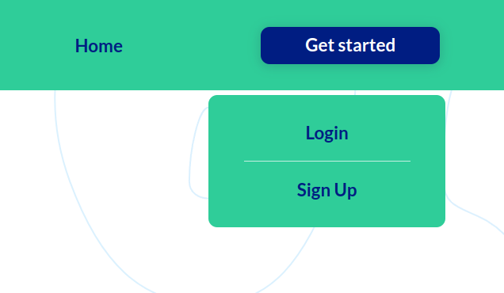
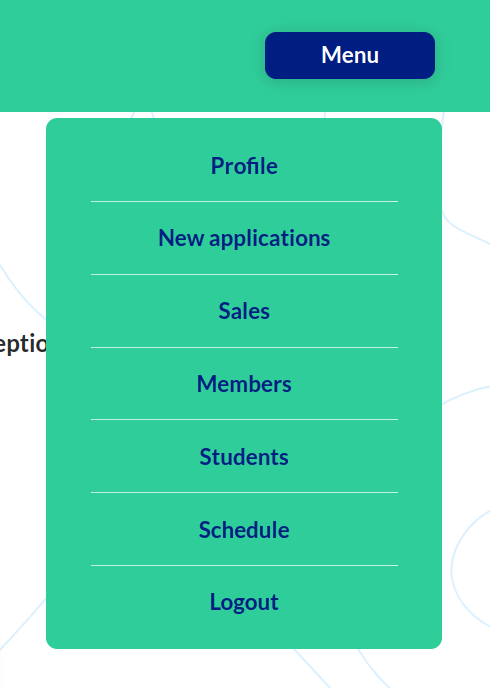
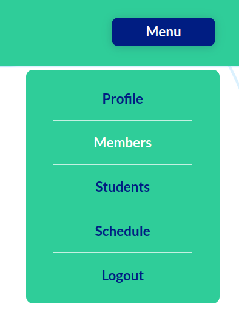
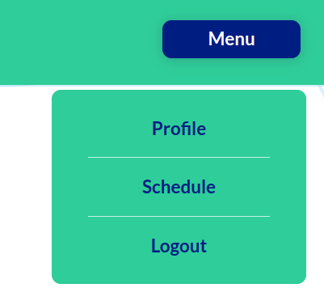

# Cool School

## **Contents**

* [About](#About)
* [User Experience Design](#User-Experience-Design)
  * [Strategy](#Strategy)
  * [Target Audience](#Target-Audience)
  * [User Stories](#User-Stories)
    * [First Time Visitor Goals](#First-Time-Visitor-Goals)
    * [Frequent Visitor Goals](#Frequent-Visitor-Goals)
    * [Potential Client Goals](#Potential-Client-Goals)
    * [Boss Goals](#Boss-Goals)
    * [Teachers' Goals](#Teachers-Goals)
    * [Receptionists' Goals](#Receptionists-Goals)
    * [Sales Managers' Goals](#Sales-Managers-Goals)
    * [Parents' Goals](#Parents-Goals)
* [Technologies used](#Technologies-used)
* [Features](#Features)
* [Design](#Design)
  * [Colour Scheme](#Colour-Scheme)
  * [Typography](#Typography)
  * [Imagery](#Imagery)
  * [Wireframes](#Wireframes)
* [Flowcharts](#Flowcharts)
* [Information Architecture](#Information-Architecture)
  * [Database](#Database)
  * [Entity-Relationship Diagram](#Entity-Relationship-Diagram)
  * [Data Modeling](#Data-Modeling)
* [Testing](#Testing)

* [Deployment](#Deployment)
  * [Local deployment](#Local-deployment)
  * [Heroku Deployment](#Heroku-Deployment)

* [Credits](#Credits)

* [Acknowledgments](#Acknowledgments)

## About

This is [Cool School app](https://school-application-konovalova.herokuapp.com/), which is a school management application. The main goal Ff this app is to help the school to manage the students, teachers, classes, subjects, etc. Moreover, the app is aimed at increasing the efficiency of the school management. The app is developed by [Iuliia Konovalova](https://github.com/IuliiaKonovalova).
Repository: [GitHub Repo](https://github.com/IuliiaKonovalova/school_app)

[Back to contents](#contents)

## User Experience Design

### Strategy

Developed for a real early childhood school, the app is designed to be easy to use and intuitive. The main goal of the app is to help the school to manage the students, teachers, classes, subjects, etc. This is achieved by the use of a simple and intuitive interface. As a final goal, the app is aimed at increasing the efficiency of the school management.

### Target Audience

The app was developed for all members of the early childhood school. 
  * Bosses: to control the flow of the school, to manage the students, teachers, classes, subjects, sales, etc.;
  * Parents: to control their children attendance, to manage their children's payments, to manage their children's schedules, etc.;
  * Teachers: to control their classes, to manage their classes' schedules, to access students' personal information on time, to manage their classes' attendance, etc.;
  * Sales Managers: to control sales, to manage the sales, to manage the payments, to manage the schedules, to access students' personal information on time, to manage the attendance, etc.;
  * Receptionists: to control the schedule of the school, to manage the schedule, to access students' personal information on time, to manage the attendance, etc.;

### User Stories

#### **First Time Visitor Goals**

| Issue ID    | User Story |
|-------------|-------------|
|[#1](https://github.com/IuliiaKonovalova/school_app/issues/1)| As a First Time Visitor, I want to be able to easily understand the main purpose of the app, so that I can learn more about this app. |
|[#2](https://github.com/IuliiaKonovalova/school_app/issues/2)|As a First Time Visitor, I want to be able to easily navigate through the app, so that I can find the content.|
|[#3](https://github.com/IuliiaKonovalova/school_app/issues/3)|As a First Time Visitor, I want to be able to register my account, so that I can learn the benefits of the app as a user.|
|[#4](https://github.com/IuliiaKonovalova/school_app/issues/4)|As a First Time Visitor, I want to be able to find the app useful, so that I can use it according to my needs.|

#### **Frequent Visitor Goals**

| Issue ID    | User Story |
|-------------|-------------|
|[#5](https://github.com/IuliiaKonovalova/school_app/issues/5)|As a Frequent User, I want to be able to log in to my account, so that I can have a personal account.|
|[#6](https://github.com/IuliiaKonovalova/school_app/issues/6)|As a Frequent User, I want to be able to easily log in and log out, so that I can access my personal account information.|
|[#7](https://github.com/IuliiaKonovalova/school_app/issues/7)|As a Frequent User, I want to be able to easily recover my password in case I forget it, so that I can recover access to my account.|
|[#8](https://github.com/IuliiaKonovalova/school_app/issues/8)|As a Frequent User, I can be able to change my password, so that I can be sure that nobody else can access my account.|

#### **Potential Client Goals**

| Issue ID    | User Story |
|-------------|-------------|
|[#9](https://github.com/IuliiaKonovalova/school_app/issues/9)|As a Potential client, I want to be contacted by sales managers, so that I can make a prudent decision about being a member.|

#### **Boss Goals**

| Issue ID    | User Story |
|-------------|-------------|
|[#11](https://github.com/IuliiaKonovalova/school_app/issues/11)|As a Boss, I want to be able to view new applications, so that I can control the flow of potential clients.|
|[#13](https://github.com/IuliiaKonovalova/school_app/issues/13)|As a Boss, I want to be able to delete or approve membership, assign a role to a new member, so that I can keep data up to date.|
|[#14](https://github.com/IuliiaKonovalova/school_app/issues/14)|As a Boss, I want to be able to add, edit data on a kid, so that I can have a profile for each student.|
|[#15](https://github.com/IuliiaKonovalova/school_app/issues/15)|As a Boss, I want to be able to delete a member, so that I can control the access to the application.|
|[#16](https://github.com/IuliiaKonovalova/school_app/issues/16)|As a Boss I can see the info about kids provided by the company: name, contact info, classes visited, how many classes left, so that refresh the information about a client.|
|[#17](https://github.com/IuliiaKonovalova/school_app/issues/17)|As a Boss, I want to be able to search for a particular member, so that I can easily access information on this member.|
|[#18](https://github.com/IuliiaKonovalova/school_app/issues/18)|As a Boss, I want to be able to sort members according to a role, so that I can easily access particular group of members.|
|[#19](https://github.com/IuliiaKonovalova/school_app/issues/19)|As a Boss, I want to be able to search for a particular student, so that I can easily access information on this student.|
|[#21](https://github.com/IuliiaKonovalova/school_app/issues/21)|As a Boss, I want to be able to sort students by the urgent sale, so that I can control the sales in the company and preserve clients.|
|[#22](https://github.com/IuliiaKonovalova/school_app/issues/22)|As a Boss, I want to be able to see lessons schedule, so that I can schedule time to talk to a teacher or a parent.|
|[#23](https://github.com/IuliiaKonovalova/school_app/issues/23)|As a Boss, I want to see see information on students for each lesson, so that I can control students’ attendance, learn clients preferences.|
|[#24](https://github.com/IuliiaKonovalova/school_app/issues/24)|As a Boss, I want to be able to see sales' details, so that I can check which sales manager and which parent was involved in a deal.|
|[#51](https://github.com/IuliiaKonovalova/school_app/issues/51)|As a Boss, I want to be able to delete students from the application, so that I can control the flow of the present students.|

#### **Teachers' Goals**

| Issue ID    | User Story |
|-------------|-------------|
|[#25](https://github.com/IuliiaKonovalova/school_app/issues/25)|As a Teacher, I want to be able to search for a particular student, so that I can easily access information on this student.|
|[#26](https://github.com/IuliiaKonovalova/school_app/issues/26)|As a Teacher, I want to be able to see personal information on a kid, so that I can know student’s personal data.|
|[#28](https://github.com/IuliiaKonovalova/school_app/issues/28)|As a Teacher, I want to be able to see lessons schedule, so that I can manage my time.|
|[#29](https://github.com/IuliiaKonovalova/school_app/issues/29)|As a Teacher, I want to be able to see information on students for each lesson, so that I can be prepared for each student.|

#### **Receptionists' Goals**

| Issue ID    | User Story |
|-------------|-------------|
|[#30](https://github.com/IuliiaKonovalova/school_app/issues/30)|As a Receptionist, I want to be able to search for a particular student, so that I can easily access information on this student.|
|[#31](https://github.com/IuliiaKonovalova/school_app/issues/31)|As a Receptionist, I want to be able to see personal information on a kid, so that I can know student’s personal data.|
|[#33](https://github.com/IuliiaKonovalova/school_app/issues/33)|As a Receptionist, I want to be able to see lessons schedule and student attending lessons, so that I can arrange the flow of the students.|
|[#34](https://github.com/IuliiaKonovalova/school_app/issues/34)|As a Receptionist, I want to be able to create lessons for a day (day, time, subject, teachers, students), so that I can provide a precise schedule for school members.|
|[#35](https://github.com/IuliiaKonovalova/school_app/issues/35)|As a Receptionist, I want to be able to render lessons for a day (day, time, subject, teachers, students), so that I can provide up to date schedule.|


#### **Sales Managers' Goals**

| Issue ID    | User Story |
|-------------|-------------|
|[#36](https://github.com/IuliiaKonovalova/school_app/issues/36)|As a Sales Manager, I want to be able to search for a particular student, so that I can easily access information on this student.|
|[#37](https://github.com/IuliiaKonovalova/school_app/issues/37)|As a Sales Manager, I want to be able to see personal information on a kid, so that I can know student’s personal data.|
|[#38](https://github.com/IuliiaKonovalova/school_app/issues/38)|As a Sales Manager, I want to be able to sort students by the urgent sale, so that I can control the sales in the company and preserve clients.|
|[#40](https://github.com/IuliiaKonovalova/school_app/issues/40)|As a Sales Manager, I want to be able to view new applications, so that I can contact a potential client and make profits for a company.|
|[#42](https://github.com/IuliiaKonovalova/school_app/issues/42)|As a Sales Manager, I want to be able to add personal notes on each student that I’m in charge of, so that I can increase the company’s sales.|
|[#43](https://github.com/IuliiaKonovalova/school_app/issues/43)|As a Sales Manager, I want to be able to add or edit information on students, so that I can keep up to date students’ profiles.|
|[#44](https://github.com/IuliiaKonovalova/school_app/issues/44)|As a Sales Manager, I want to be able to review my sales, so that I can control my performance.|
|[#45](https://github.com/IuliiaKonovalova/school_app/issues/45)|As a Sales Manager, I want to be able to add new classes to a child when parents buy classes, so that I can maintain relationships with clients.|
|[#52](https://github.com/IuliiaKonovalova/school_app/issues/52)|As a Sales Manager, I want to be able to delete students from the application, so that I can control the flow of the present students.|
|[#53](https://github.com/IuliiaKonovalova/school_app/issues/53)|As a Sales Manager I can edit information on about a sale so that change the data on a sale if a mistake was made or a parent changed his or her mind.|
|[#54](https://github.com/IuliiaKonovalova/school_app/issues/54)|As a Sales Manager I can delete information on about a sale so that render sales data if a mistake was made or a parent changed his or her mind.|
|[#61](https://github.com/IuliiaKonovalova/school_app/issues/61)|As a Sales Manager I want to control my own sales so that nobody else can edit or delete my sales.|
#### **Parents' Goals**

| Issue ID    | User Story |
|-------------|-------------|
|[#46](https://github.com/IuliiaKonovalova/school_app/issues/46)|As a Parent, I want to be able to see personal information on my child/children, so that I can check the personal data.|
|[#47](https://github.com/IuliiaKonovalova/school_app/issues/47)|As a Parent, I want to be able to see my child’s attendance (subject, teacher, date), so that I can control my child’s education and my spending.|
|[#48](https://github.com/IuliiaKonovalova/school_app/issues/48)|As a Parent, I want to be able to see lessons schedule, so that I can manage my time and control child’s attendance.|
|[#49](https://github.com/IuliiaKonovalova/school_app/issues/49)|As a Parent, I want to be able to see information on students for each lesson, so that I can prepare my child for a lesson.|
|[#50](https://github.com/IuliiaKonovalova/school_app/issues/50)|As a Parent, I want to be able to see names of teachers for each lesson, so that I can know who is/are teaching a lesson.|

[Back to contents](#contents)

---

## Technologies used

- ### Languages:
    
    + [Python 3.8.5](https://www.python.org/downloads/release/python-385/): the main language used to develop the server side of the website.
    + [JS](https://www.javascript.com/): the main language used to develop the client side of the website.
    + [HTML](https://developer.mozilla.org/en-US/docs/Web/HTML): the markup language used to create the website.
    + [CSS](https://developer.mozilla.org/en-US/docs/Web/css): the styling language used to style the website.

- ### Frameworks and libraries:

    + [Django](https://www.djangoproject.com/): python framework used to create all the logic.
    + [jQuery](https://jquery.com/): was used to control click events and sending AJAX requests.
    + [jQuery User Interface](https://jqueryui.com/) was used to create interactive elements.

- ### Databases:

    + [SQLite](https://www.sqlite.org/): was used as a development database.
    + [PostgreSQL](https://www.postgresql.org/): the database used to store all the data.

- ### Other tools:

    + [Git](https://git-scm.com/): the version control system used to manage the code.
    + [Pip3](https://pypi.org/project/pip/): the package manager used to install the dependencies.
    + [Gunicorn](https://gunicorn.org/): the web server used to run the website.
    + [Spycopg2](https://www.python.org/dev/peps/pep-0249/): the database driver used to connect to the database.
    + [Django-allauth](https://django-allauth.readthedocs.io/en/latest/): the authentication library used to create the user accounts.
    + [Django-crispy-forms](https://django-cryptography.readthedocs.io/en/latest/): was used to control the rendering behavior of Django forms.
    + [Heroku](https://dashboard.heroku.com/): the hosting service used to host the website.
    + [GitHub](https://github.com/): used to host the source code of the website.
    + [VSCode](https://code.visualstudio.com/): the IDE used to develop the website.
    + [Chrome DevTools](https://developer.chrome.com/docs/devtools/open/): was used to debug the website.
    + [Font Awesome](https://fontawesome.com/): was used to create the icons used in the website.
    + [Draw.io](https://www.lucidchart.com/) was used to make a flowchart for the README file.
    + [Coolors](https://coolors.co/202a3c-1c2431-181f2a-0b1523-65e2d9-925cef-6b28e0-ffffff-eeeeee) was used to make a color palette for the website.
    + [BGJar](https://www.bgjar.com/): was used to make a background images for the website.
    + [W3C Validator](https://validator.w3.org/): was used to validate HTML5 code for the website.
    + [W3C CSS validator](https://jigsaw.w3.org/css-validator/): was used to validate CSS code for the website.
    + [JShint](https://jshint.com/): was used to validate JS code for the website.
    + [PEP8](https://pep8.org/): was used to validate Python code for the website.

[Back to contents](#contents)

---

## Features

Web application has the following pages:
- home page
- login page
- registration page
- logout page
- profile page
- edit profile page
- change password page
- delete member page
- members page
- new applications page
- application detail page
- delete application page
- sales page
- add sale page
- edit sale page
- delete sale page
- students page
- student detail page
- add student page
- edit student page
- delete student page
- schedule page
- lesson page
- add lesson page
- edit lesson page
- delete lesson page
- teacher's personal schedule page

### Access to pages according to the user role:

| Page Name     | Boss  | Teacher    | Sales Manager | Receptionist | Parent | Potential Client |
| ------------- | ------------- | ------------- | ---------- | ------------- | ------------- | ------------- |
| home page                   | Y | Y | Y | Y | Y | Y |
| login page                  | Y | Y | Y | Y | Y | Y |
| registration page           | Y | Y | Y | Y | Y | Y |
| logout page                 | Y | Y | Y | Y | Y | Y |
| user's profile page         | Y | Y | Y | Y | Y | Y |
| other user's profile page   | Y (all data + delete member functionality) | Y (all data except sales made by a sales manager and other teachers' classes) | Y (all data except teachers' classes and other sales managers' sales ) | Y (all data except teachers's classes and sales of the sales managers) | Y (only name, phone number and email) | Y (only name, phone number and email) |
| edit profile page           | Y | Y | Y | Y | Y | Y |
| delete member         | Y | N | N | N | N | N |
| change password page        | Y | Y | Y | Y | Y | Y |
| members page                | Y | Y | Y | Y | N | N |
| new applications page       | Y | N | Y | N | N | N |
| application detail page     | Y (plus assign role and delete application) | N | Y | N | N | N |
| delete application page     | Y | N | N | N | N | N |
| sales page                  | Y | N | Y (plus add sale and edit or delete personal sales only) | N | N | N |
| add sale page               | N | N | Y | N | N | N |
| edit sale page              | N | N | Y | N | N | N |
| delete sale page            | N | N | Y | N | N | N |
| students page               | Y (plus add student button) | Y | Y (plus add student button) | Y | N | N |
| student detail page         | Y (plus delete and edit functionality) | Y | Y (plus delete and edit functionality) | Y | Y (only their own children) | N |
| add student page            | Y | N | Y | N | N | N |
| edit student page           | Y | N | Y | N | N | N |
| delete student page         | Y | N | Y | N | N | N |
| schedule page               | Y | Y (plus view personal schedule functionality) | Y | Y (plus add lesson functionality) | Y | Y |
| lesson page                 | Y | Y | Y | Y | Y (except view other students' profiles) | Y (except view students' profiles functionality) |
| add lesson page             | N | N | N | Y | N | N |
| edit lesson page            | N | N | N | Y | N | N |
| delete lesson page          | N | N | N | Y | N | N |
| teacher's personal schedule page | N | Y | N | N | N | N |

- Each page has a navbar and footer

**Navbar**


Navbar has the following links:
- home page
- button "get started", which leads to the registration page and login page
- 
- It also has a logo of the school
- 

The simplistic design of the navbar is based on the decision to make the use of the webapp easy for the user.

When the user clicks on the get started button, the menu opens and the user can choose to register or login.

-  

When the user is logged in, the navbar looks as following.

- 

It has only one button "Menu", which opens the menu.

- 

If the user is a boss or a sales manager, the menu has the following links:

- 

Menu has the following buttons:
- Profile (which leads to the user profile page)
- New applications (which leads to the new applications page)
- Sales (which leads to the sales page)
- Members (which leads to the members page)
- Students (which leads to the students page)
- Schedule (which leads to the schedule page)
- Logout (which leads to the logout page)

If the user is a teacher or receptionist, the menu has the following look:

- 

Menu has the following buttons:
- Profile (which leads to the user profile page)
- Members (which leads to the members page)
- Students (which leads to the students page)
- Schedule (which leads to the schedule page)
- Logout (which leads to the logout page)

if the user is a parent or a potential client, the menu has the following look:

- 

Menu has the following buttons:
- Profile (which leads to the user profile page)
- Schedule (which leads to the schedule page)
- Logout (which leads to the logout page)


[Back to contents](#contents)

---
## Design


### Wireframes

- [Desktop Wireframes](documentation/wireframes/pp4_desktop.pdf)
- [Tablet Wireframes](documentation/wireframes/pp4_tablet.pdf)
- [Mobile Wireframes](documentation/wireframes/pp4_mobile.pdf)

[Back to contents](#contents)

---

## Flowcharts

This application is aimed at users with different roles to fulfill there expectations and provide all functionality.

The following flowcharts were created to help to understand the application and its functionality.

The flowcharts were created using [Draw.io](https://www.lucidchart.com/).

- [Flowchart for Bosses](documentation/flowcharts/flowchart_boss.pdf)
- [Flowchart for Sales Managers](documentation/flowcharts/flowchart_sales.pdf)
- [Flowchart for Parents](documentation/flowcharts/flowchart_parent.pdf)
- [Flowchart for Teachers](documentation/flowcharts/flowchart_teachers.pdf)
- [Flowchart for Receptionist](documentation/flowcharts/flowchart_receptionist.pdf)

[Back to contents](#contents)

---

## Information Architecture

### Database

* During the earliest stages of the project, the database was created using SQLite.
* The database was then migrated to PostgreSQL.

### Entity-Relationship Diagram

* The ERD was created using [Draw.io](https://www.lucidchart.com/).

- [Database Scheme](documentation/diagrams/db_final.pdf)

### Data Modeling

1. **CustomUser**

Extends Allauth's User model.

| Name          | Database Key  | Field Type    | Validation |
| ------------- | ------------- | ------------- | ---------- |
| UserName      | username      | CharField     |  max_length=50, blank=False, null=True, unique=True    |
| Email         | email         | EmailField    | max_length=50, unique=True, blank=False, null=False    |
| First Name    | first_name    | CharField     | max_length=30, blank=False, null=False    |
| Last Name     | last_name     | CharField     | max_length=30, blank=False, null=False    |
| Phone Number  | email         | CharField     | max_length=30, blank=False, null=False    |
| Role          | phone         | IntegerField  | choices=ROLES, default=5    |


```Python
    # Roles to assign to users
    ROLES = (
        (0, 'boss'),
        (1, 'teacher'),
        (2, 'sales'),
        (3, 'receptionist'),
        (4, 'parent'),
        (5, 'potential user'),
    )
```

2. **Teacher**

Was created in order to provide more room for manipulation of the database and provide opportunities for the future developments. Users with the role of teacher will be automatically assigned to this table.

| Name          | Database Key  | Field Type    | Validation |
| ------------- | ------------- | ------------- | ---------- |
| Teacher       | user          | ForeignKey    |  CustomUser, on_delete=models.CASCADE  |

3. **Receptionist**

Was created in order to provide more room for manipulation of the database and provide opportunities for the future developments.

| Name          | Database Key  | Field Type    | Validation |
| ------------- | ------------- | ------------- | ---------- |
| Receptionist  | user          | ForeignKey    |  CustomUser, on_delete=models.CASCADE  |

4. **SalesManager**

Was created in order to provide more room for manipulation of the database and provide opportunities for the future developments. Users with the role of sales manager will be automatically assigned to this table.

| Name          | Database Key  | Field Type    | Validation |
| ------------- | ------------- | ------------- | ---------- |
| Sales Manager | user          | ForeignKey    |  CustomUser, on_delete=models.CASCADE  |
| Sales Total   | total_sold    | IntegerField  |  default=0, blank=True, null=True  |

5. **Parent**

Was created in order to provide more room for manipulation of the database and provide opportunities for the future developments. Users with the role of parent will be automatically assigned to this table.

| Name          | Database Key  | Field Type    | Validation |
| ------------- | ------------- | ------------- | ---------- |
| Sales Manager | user          | ForeignKey    |  CustomUser, on_delete=models.CASCADE  |
| Relation to a student  | relation      | IntegerField  |  choices=GUARDIAN_RELATION, default=5  |

```Python
    # Guardian's relation to the student
    GUARDIAN_RELATION = (
        (1, 'father'),
        (2, 'mother'),
        (3, 'grandfather'),
        (4, 'grandmother'),
        (5, 'other'),
    )
```
6. **Student**

This table does not inherit from the CustomUser model. This is because the students are not users. Instead, they are the main table of the application.

| Name          | Database Key  | Field Type    | Validation |
| ------------- | ------------- | ------------- | ---------- |
| First Name         | first_name    | CharField       | max_length=50, blank=False, null=False    |
| Last Name          | last_name     | CharField       | max_length=50, blank=False, null=False    |
| Parents            | parent        | ManyToManyField | Parent, related_name='child'  |
| Birthday           | birthday      | DateField       |          |
| Address            | address       | CharField       | max_length=100, blank=True, null=True |
| Date of enrollment | enrolled      | DateTimeField   | auto_now_add=True    |
| Classes left       | classes_left  | IntegerField    | default=0, blank=True, null=True    |
| Sales Manager      | sales_manager | ManyToManyField | SalesManager, related_name='student'    |
| Notes              | notes         | TextField       | blank=True    |

7. **Sales**

This table is needed to conduct sales operations. It controls the sales of the products. It is also adds classes to a particular student and adds total classes sold to a sales manager. Separate field "student_id" was added in order to prevent a circular import but allow sales to be in control of classes added to a particular student or reduced (For example, when parents asks for a refund).

| Name          | Database Key  | Field Type    | Validation |
| ------------- | ------------- | ------------- | ---------- |
| Sales Manager | sold_by       | ForeignKey    | SalesManager, on_delete=models.CASCADE, related_name='sold'   |
| Client(Parent)| sold_to       | ForeignKey    | Parent, on_delete=models.CASCADE, related_name='bought'   |
| Classes Number| amount        | IntegerField  |            |
| Date of Sale  | date          | DateTimeField | auto_now_add=True    |
| Student       | amount        | IntegerField  |  default=0          |

8. **Lesson**

This table is necessary to control the lessons and provide data for schedule.

| Name          | Database Key  | Field Type     | Validation |
| ------------- | ------------- | -------------- | ---------- |
| Class's Date  | date          | DateField      |            |
| Class's Time  | time          | IntegerField   | choices=TIME_PERIODS, default=0 |
| Subject       | subject       | IntegerField   | choices=SUBJECTS, default=1     |
| Teachers      | teachers      | ManyToManyField| Teacher, related_name='lessons' |
| Students      | students      | ManyToManyField| Student, related_name='lessons' |


```Python
    # Time periods variations
    TIME_PERIODS = (
        (0, '9:00-9:45'),
        (1, '10:00-10:45'),
        (2, '11:00-11:45'),
        (3, '14:00-14:45'),
        (4, '15:00-15:45'),
        (5, '16:00-16:45'),
        (6, '17:00-17:45'),
        (7, '18:00-18:45'),
    )

    # Subject variations
    SUBJECTS = (
        (1, 'art'),
        (2, 'math'),
        (3, 'casa'),
        (4, 'chinese'),
        (5, 'toddlers'),
        (6, 'music'),
        (7, 'english'),
        (8, 'sport'),
        (9, 'cooking'),
        (10, 'infants'),
    )
```


[Back to contents](#contents)

---
## Testing

Please refer to the [TESTING.md](TESTING.md) file for all test related documentation.

[Back to contents](#contents)

---

## Deployment

- The program was deployed to [Heroku](https://dashboard.heroku.com).
- The program can be reached by the [link](https://issue-tracker-by-konovalovs.herokuapp.com/)
### Local deployment

*Note:*
  - This project requires install all the requirements:
  - Open the terminal window and type:
  - `pip3 install -r requirements.txt`

Create a local copy of the GitHub repository by following one of the two processes below:

- Download ZIP file:
  1. Go to the [GitHub Repo page](https://github.com/IuliiaKonovalova/issue_tracker).
  1. Click the Code button and download the ZIP file containing the project.
  1. Extract the ZIP file to a location on your PC.

- Clone the repository:
  1. Open a folder on your computer with the terminal.
  1. Run the following command
  - `git clone https://github.com/IuliiaKonovalova/issue_tracker.git`

- Alternatively, if using Gitpod, you can click below to create your own workspace using this repository.

  [](https://gitpod.io/#https://github.com/IuliiaKonovalova/issue_tracker)

---

1. Install the dependencies:
  - Open the terminal window and type:
  - `pip3 install -r requirements.txt`

1. Create a .gitignore file in the root directory of the project where you should add env.py and __pycache__ files to prevent the privacy of your secret data.

1. Create a .env file. This will contain the following environment variables:

    ```python
    import os

      os.environ("SECRET_KEY", "Add a secret key")
      os.environ("DATABASE_URL", "will be used to connect to the database")
    ```

1. Run following commands in a terminal to make migrations: 
    - `python3 manage.py makemigrations`
    - `python3 manage.py migrate`
1. Create a superuser to get access to the admin environment.
    - `python3 manage.py createsuperuser`
    - Enter required information (your username, email and password).
1. Run the app with the following command in the terminal:
    - `python3 manage.py runserver`
1. Open the link provided in a browser to see the app.

1. If you need to access admin page:
    - Add /admin/ to the link provided.
    - Enter your username and password (for the superuser that you have created before).
    - You will be redirected to the admin page.


### Heroku Deployment

1. Set up a local workspace on your computer for Heroku:
    - Create a list of requirements that the project needs to run:
      - type in this in the terminal: `pip3 freeze > requirements.txt`
    - Commit and push the changes to GitHub
    
1. Go to [www.heroku.com](www.heroku.com) 
1. Login or create a Heroku account.
1. Create a new app with any unique name <name app>.
1. Create a Procfile in your local workplace, which will contain the following:
    ```python
        web: gunicorn <name app>.wsgi:application
    ```
    - Commit and push the changes to GitHub.

1. Go to resources in Heroku and search for postgresql. Select Hobby dev - Free and click on the provision button to add it to the project.

1. Go to the settings app in Heroku and go to Config Vars. Click on Reveal Config Vars and add the following config variables:

| Key      | Value          |
|-------------|-------------|
| DATABASE_URL | ... | 
| DISABLE_COLLECTSTATIC | 1 |
| EMAIL_HOST_PASS | ... |
| EMAIL_HOST_USER | ... |
| HEROKU_HOSTNAME | ... |
| SECRET_KEY | ... |


1. Copy the value of DATABASE_URL and input it into the .env file.
1. Create EMAIL_HOST_PASS and EMAIL_HOST_USER with gmail account and add values to these keys.
1. Migrate changes.
1. Set debug to False in settings.py
1. Commit and push the changes to GitHub.


[Back to contents](#contents)

---


