# Cool School

Live Version: [Cool School](https://cool-school.onrender.com)


Repository: [GitHub Repo](https://github.com/IuliiaKonovalova/school_app)

The app is developed by [Iuliia Konovalova](https://github.com/IuliiaKonovalova).


## About

[Cool School app](https://cool-school.onrender.com) is a school management application. The main goal Ff this app is to help the school manage the students, teachers, classes, subjects, etc. Moreover, the app is aimed at increasing the efficiency of school management. 


[Back to contents](#contents)

## User Experience Design

### Strategy

Developed for a real early childhood school, the app is designed to be easy to use and intuitive. The main goal of the app is to help the school to manage the students, teachers, classes, subjects, etc. This has been achieved by the use of a simple and intuitive interface. As a final goal, the app is aimed at increasing the efficiency of school management.

### Target Audience

The app was developed for all members of the early childhood school. 
  * Bosses: to control the flow of the school, to manage the students, teachers, classes, subjects, sales, etc.;
  * Parents: to control their children attendance, to manage their children's payments, manage their children's schedules, etc.;
  * Teachers: to control their classes, to manage their classes' schedules, access students' personal information on time, manage their classes' attendance, etc.;
  * Sales Managers: to control sales, manage the sales, manage the payments, manage the schedules, access students' personal information on time, manage the attendance, etc.;
  * Receptionists: to control the schedule of the school, manage the schedule, access students' personal information on time, manage the attendance, etc.;

### User Stories

#### **First Time Visitor Goals**

| Issue ID    | User Story |
|-------------|-------------|
|[#1](https://github.com/IuliiaKonovalova/school_app/issues/1)| As a First Time Visitor, I want to be able to easily understand the main purpose of the app, so that I can learn more about this app. |
|[#2](https://github.com/IuliiaKonovalova/school_app/issues/2)|As a First Time Visitor, I want to be able to easily navigate through the app, so that I can find the content.|
|[#3](https://github.com/IuliiaKonovalova/school_app/issues/3)|As a First Time Visitor, I want to be able to register my account, so that I can learn the benefits of the app as a user.|
|[#4](https://github.com/IuliiaKonovalova/school_app/issues/4)|As a First Time Visitor, I want to be able to find the app useful, so that I can use it according to my needs.|

#### **Frequent Visitor Goals**

| Issue ID    | User Story |
|-------------|-------------|
|[#5](https://github.com/IuliiaKonovalova/school_app/issues/5)|As a Frequent User, I want to be able to log in to my account, so that I can have a personal account.|
|[#6](https://github.com/IuliiaKonovalova/school_app/issues/6)|As a Frequent User, I want to be able to easily log in and log out, so that I can access my personal account information.|
|[#7](https://github.com/IuliiaKonovalova/school_app/issues/7)|As a Frequent User, I want to be able to easily recover my password in case I forget it, so that I can recover access to my account.|
|[#8](https://github.com/IuliiaKonovalova/school_app/issues/8)|As a Frequent User, I can be able to change my password, so that I can be sure that nobody else can access my account.|

#### **Potential Client Goals**

| Issue ID    | User Story |
|-------------|-------------|
|[#9](https://github.com/IuliiaKonovalova/school_app/issues/9)|As a Potential client, I want to be contacted by sales managers, so that I can make a prudent decision about becoming a member.|

#### **Boss Goals**

| Issue ID    | User Story |
|-------------|-------------|
|[#11](https://github.com/IuliiaKonovalova/school_app/issues/11)|As a Boss, I want to be able to view new applications, so that I can control the flow of potential clients.|
|[#13](https://github.com/IuliiaKonovalova/school_app/issues/13)|As a Boss, I want to be able to delete or approve membership, assign a role to a new member, so that I can keep data up to date.|
|[#14](https://github.com/IuliiaKonovalova/school_app/issues/14)|As a Boss, I want to be able to add, edit data on a kid, so that I can have a profile for each student.|
|[#15](https://github.com/IuliiaKonovalova/school_app/issues/15)|As a Boss, I want to be able to delete a member, so that I can control the access to the application.|
|[#16](https://github.com/IuliiaKonovalova/school_app/issues/16)|As a Boss I can see the info about kids provided by the company: name, contact info, classes visited, how many classes left, so that refresh the information about a client.|
|[#17](https://github.com/IuliiaKonovalova/school_app/issues/17)|As a Boss, I want to be able to search for a particular member, so that I can easily access information on this member.|
|[#18](https://github.com/IuliiaKonovalova/school_app/issues/18)|As a Boss, I want to be able to sort members according to a role, so that I can easily access particular group of members.|
|[#19](https://github.com/IuliiaKonovalova/school_app/issues/19)|As a Boss, I want to be able to search for a particular student, so that I can easily access information on this student.|
|[#21](https://github.com/IuliiaKonovalova/school_app/issues/21)|As a Boss, I want to be able to sort students by the urgent sale, so that I can control the sales in the company and preserve clients.|
|[#22](https://github.com/IuliiaKonovalova/school_app/issues/22)|As a Boss, I want to be able to see lessons schedule, so that I can schedule time to talk to a teacher or a parent.|
|[#23](https://github.com/IuliiaKonovalova/school_app/issues/23)|As a Boss, I want to see see information on students for each lesson, so that I can control students’ attendance, learn clients preferences.|
|[#24](https://github.com/IuliiaKonovalova/school_app/issues/24)|As a Boss, I want to be able to see sales' details, so that I can check which sales manager and which parent was involved in a deal.|
|[#51](https://github.com/IuliiaKonovalova/school_app/issues/51)|As a Boss, I want to be able to delete students from the application, so that I can control the flow of the present students.|

#### **Teachers' Goals**

| Issue ID    | User Story |
|-------------|-------------|
|[#25](https://github.com/IuliiaKonovalova/school_app/issues/25)|As a Teacher, I want to be able to search for a particular student, so that I can easily access information on this student.|
|[#26](https://github.com/IuliiaKonovalova/school_app/issues/26)|As a Teacher, I want to be able to see personal information on a kid, so that I can know student’s personal data.|
|[#28](https://github.com/IuliiaKonovalova/school_app/issues/28)|As a Teacher, I want to be able to see lessons schedule, so that I can manage my time.|
|[#29](https://github.com/IuliiaKonovalova/school_app/issues/29)|As a Teacher, I want to be able to see information on students for each lesson, so that I can be prepared for each student.|

#### **Receptionists' Goals**

| Issue ID    | User Story |
|-------------|-------------|
|[#30](https://github.com/IuliiaKonovalova/school_app/issues/30)|As a Receptionist, I want to be able to search for a particular student, so that I can easily access information on this student.|
|[#31](https://github.com/IuliiaKonovalova/school_app/issues/31)|As a Receptionist, I want to be able to see personal information on a kid, so that I can know student’s personal data.|
|[#33](https://github.com/IuliiaKonovalova/school_app/issues/33)|As a Receptionist, I want to be able to see lessons schedule and student attending lessons, so that I can arrange the flow of the students.|
|[#34](https://github.com/IuliiaKonovalova/school_app/issues/34)|As a Receptionist, I want to be able to create lessons for a day (day, time, subject, teachers, students), so that I can provide a precise schedule for school members.|
|[#35](https://github.com/IuliiaKonovalova/school_app/issues/35)|As a Receptionist, I want to be able to render lessons for a day (day, time, subject, teachers, students), so that I can provide up to date schedule.|


#### **Sales Managers' Goals**

| Issue ID    | User Story |
|-------------|-------------|
|[#36](https://github.com/IuliiaKonovalova/school_app/issues/36)|As a Sales Manager, I want to be able to search for a particular student, so that I can easily access information on this student.|
|[#37](https://github.com/IuliiaKonovalova/school_app/issues/37)|As a Sales Manager, I want to be able to see personal information on a kid, so that I can know student’s personal data.|
|[#38](https://github.com/IuliiaKonovalova/school_app/issues/38)|As a Sales Manager, I want to be able to sort students by the urgent sale, so that I can control the sales in the company and preserve clients.|
|[#40](https://github.com/IuliiaKonovalova/school_app/issues/40)|As a Sales Manager, I want to be able to view new applications, so that I can contact a potential client and make profits for a company.|
|[#42](https://github.com/IuliiaKonovalova/school_app/issues/42)|As a Sales Manager, I want to be able to add personal notes on each student that I’m in charge of, so that I can increase the company’s sales.|
|[#43](https://github.com/IuliiaKonovalova/school_app/issues/43)|As a Sales Manager, I want to be able to add or edit information on students, so that I can keep up to date students’ profiles.|
|[#44](https://github.com/IuliiaKonovalova/school_app/issues/44)|As a Sales Manager, I want to be able to review my sales, so that I can control my performance.|
|[#45](https://github.com/IuliiaKonovalova/school_app/issues/45)|As a Sales Manager, I want to be able to add new classes to a child when parents buy classes, so that I can maintain relationships with clients.|
|[#52](https://github.com/IuliiaKonovalova/school_app/issues/52)|As a Sales Manager, I want to be able to delete students from the application, so that I can control the flow of the present students.|
|[#53](https://github.com/IuliiaKonovalova/school_app/issues/53)|As a Sales Manager I can edit information on about a sale so that change the data on a sale if a mistake was made or a parent changed his or her mind.|
|[#54](https://github.com/IuliiaKonovalova/school_app/issues/54)|As a Sales Manager I can delete information on about a sale so that render sales data if a mistake was made or a parent changed his or her mind.|
|[#61](https://github.com/IuliiaKonovalova/school_app/issues/61)|As a Sales Manager I want to control my own sales so that nobody else can edit or delete my sales.|
#### **Parents' Goals**

| Issue ID    | User Story |
|-------------|-------------|
|[#46](https://github.com/IuliiaKonovalova/school_app/issues/46)|As a Parent, I want to be able to see personal information on my child/children, so that I can check the personal data.|
|[#47](https://github.com/IuliiaKonovalova/school_app/issues/47)|As a Parent, I want to be able to see my child’s attendance (subject, teacher, date), so that I can control my child’s education and my spending.|
|[#48](https://github.com/IuliiaKonovalova/school_app/issues/48)|As a Parent, I want to be able to see lessons schedule, so that I can manage my time and control child’s attendance.|
|[#49](https://github.com/IuliiaKonovalova/school_app/issues/49)|As a Parent, I want to be able to see information on students for each lesson, so that I can prepare my child for a lesson.|
|[#50](https://github.com/IuliiaKonovalova/school_app/issues/50)|As a Parent, I want to be able to see names of teachers for each lesson, so that I can know who is/are teaching a lesson.|

[Back to contents](#contents)

---

## Technologies used

- ### Languages:
    
    + [Python 3.8.5](https://www.python.org/downloads/release/python-385/): the primary language used to develop the server-side of the website.
    + [JS](https://www.javascript.com/): the primary language used to develop interactive components of the website.
    + [HTML](https://developer.mozilla.org/en-US/docs/Web/HTML): the markup language used to create the website.
    + [CSS](https://developer.mozilla.org/en-US/docs/Web/css): the styling language used to style the website.

- ### Frameworks and libraries:

    + [Django](https://www.djangoproject.com/): python framework used to create all the logic.
    + [jQuery](https://jquery.com/): was used to control click events and sending AJAX requests.
    + [jQuery User Interface](https://jqueryui.com/) was used to create interactive elements.

- ### Databases:

    + [SQLite](https://www.sqlite.org/): was used as a development database.
    + [PostgreSQL](https://www.postgresql.org/): the database used to store all the data.

- ### Other tools:

    + [Git](https://git-scm.com/): the version control system used to manage the code.
    + [Pip3](https://pypi.org/project/pip/): the package manager used to install the dependencies.
    + [Gunicorn](https://gunicorn.org/): the webserver used to run the website.
    + [Spycopg2](https://www.python.org/dev/peps/pep-0249/): the database driver used to connect to the database.
    + [Django-allauth](https://django-allauth.readthedocs.io/en/latest/): the authentication library used to create the user accounts.
    + [Django-crispy-forms](https://django-cryptography.readthedocs.io/en/latest/): was used to control the rendering behavior of Django forms.
    + [Heroku](https://dashboard.heroku.com/): the hosting service used to host the website.
    + [GitHub](https://github.com/): used to host the website's source code.
    + [VSCode](https://code.visualstudio.com/): the IDE used to develop the website.
    + [Chrome DevTools](https://developer.chrome.com/docs/devtools/open/): was used to debug the website.
    + [Font Awesome](https://fontawesome.com/): was used to create the icons used in the website.
    + [Draw.io](https://www.lucidchart.com/) was used to make a flowchart for the README file.
    + [Coolors](https://coolors.co/202a3c-1c2431-181f2a-0b1523-65e2d9-925cef-6b28e0-ffffff-eeeeee) was used to make a color palette for the website.
    + [BGJar](https://www.bgjar.com/): was used to make a background images for the website.
    + [W3C Validator](https://validator.w3.org/): was used to validate HTML5 code for the website.
    + [W3C CSS validator](https://jigsaw.w3.org/css-validator/): was used to validate CSS code for the website.
    + [JShint](https://jshint.com/): was used to validate JS code for the website.
    + [PEP8](https://pep8.org/): was used to validate Python code for the website.

[Back to contents](#contents)

---

## Features

Web application has the following pages:
- home page
- login page
- registration page
- logout page
- profile page
- edit profile page
- change password page
- delete member page
- members page
- new applications page
- application detail page
- delete application page
- sales page
- add sale page
- edit sale page
- delete sale page
- students page
- student detail page
- add student page
- edit student page
- delete student page
- schedule page
- lesson page
- add lesson page
- edit lesson page
- delete lesson page
- teacher's personal schedule page

### Access to pages according to the user role:

| Page Name     | Boss  | Teacher    | Sales Manager | Receptionist | Parent | Potential Client |
| ------------- | ------------- | ------------- | ---------- | ------------- | ------------- | ------------- |
| home page                   | Y | Y | Y | Y | Y | Y |
| login page                  | Y | Y | Y | Y | Y | Y |
| registration page           | Y | Y | Y | Y | Y | Y |
| logout page                 | Y | Y | Y | Y | Y | Y |
| user's profile page         | Y | Y | Y | Y | Y | Y |
| other user's profile page   | Y (all data + delete member functionality) | Y (all data except sales made by a sales manager and other teachers' classes) | Y (all data except teachers' classes and other sales managers' sales ) | Y (all data except teachers's classes and sales of the sales managers) | Y (only name, phone number and email) | Y (only name, phone number and email) |
| edit profile page           | Y | Y | Y | Y | Y | Y |
| delete member         | Y | N | N | N | N | N |
| change password page        | Y | Y | Y | Y | Y | Y |
| members page                | Y | Y | Y | Y | N | N |
| new applications page       | Y | N | Y | N | N | N |
| application detail page     | Y (plus assign role and delete application) | N | Y | N | N | N |
| delete application page     | Y | N | N | N | N | N |
| sales page                  | Y | N | Y (plus add a sale and edit or delete personal sales only) | N | N | N |
| add sale page               | N | N | Y | N | N | N |
| edit sale page              | N | N | Y | N | N | N |
| delete sale page            | N | N | Y | N | N | N |
| students page               | Y (plus add student button) | Y | Y (plus add student button) | Y | N | N |
| student detail page         | Y (plus delete and edit functionality) | Y | Y (plus delete and edit functionality) | Y | Y (only their own children) | N |
| add student page            | Y | N | Y | N | N | N |
| edit student page           | Y | N | Y | N | N | N |
| delete student page         | Y | N | Y | N | N | N |
| schedule page               | Y | Y (plus view personal schedule functionality) | Y | Y (plus add lesson functionality) | Y | Y |
| lesson page                 | Y | Y | Y | Y | Y (except view other students' profiles) | Y (except view students' profiles functionality) |
| add lesson page             | N | N | N | Y | N | N |
| edit lesson page            | N | N | N | Y | N | N |
| delete lesson page          | N | N | N | Y | N | N |
| teacher's personal schedule page | N | Y | N | N | N | N |

- Each page has a navbar and a footer

**Navbar**


Navbar has the following links:
- home page
- button "get started", which leads to the registration page and login page
- 
- It also has a logo of the school
- 

The simplistic design of the navbar is based on the decision to make the use of the webapp easy for the user.

When the user clicks on the get started button, the menu opens, and the user can choose to register or log in.

-  

When the user is logged in, the navbar looks as follows.

- 

It has only one button "Menu", which opens the menu.

- 

If the user is a boss or a sales manager, the menu has a following links:

- 

Menu has the following buttons:
- Profile (which leads to the user profile page)
- New applications (which leads to the new applications page)
- Sales (which leads to the sales page)
- Members (which leads to the members page)
- Students (which leads to the students page)
- Schedule (which leads to the schedule page)
- Logout (which leads to the logout page)

If the user is a teacher or a receptionist, the menu has a following look:

- 

Menu has the following buttons:
- Profile (which leads to the user profile page)
- Members (which leads to the members page)
- Students (which leads to the students page)
- Schedule (which leads to the schedule page)
- Logout (which leads to the logout page)

if the user is a parent or a potential client, the menu has a following look:

- 

Menu has the following buttons:
- Profile (which leads to the user profile page)
- Schedule (which leads to the schedule page)
- Logout (which leads to the logout page)

**Footer**


Footer has the following sections:

- Logo in the top left corner:

  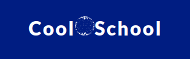

- School information in the middle with the school email, phone number, and address:

  

- Information about the coder is on the right side with links to the GitHub and LinkedIn, and email:

  


For the mobile version of the website, the footer looks as follows:

  


**Home page**


The Home page has a simple welcome message and a button "get started" which leads to the registration page, from which the user can be redirected to the login page.

- 

Under the hero section, there is a section, which describes the benefits of signing up.

- 

This section has 3 cards, each with a title, a description, and an image.

On the mobile version, the cards are displayed in two rows.

  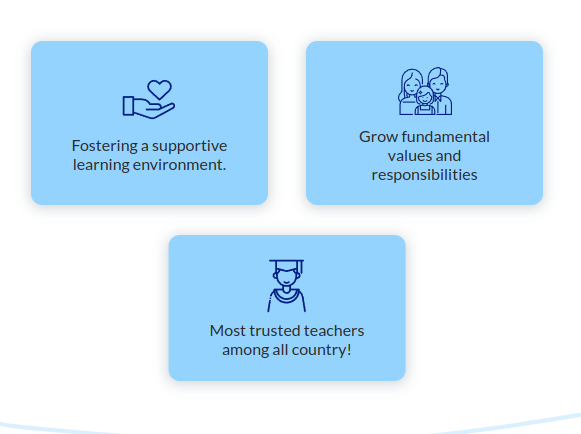

After the cards, there are 3 subsections.

1. The first subsection has a text incentive on the left side and an image on the right side.

  

2. The second subsection has a text describing the school's personnel on the right side and an image on the left side.

  

3. The third subsection has a text describing the school's concern about children's health on the left side and an image on the right side.

  


After the subsections, there is an immediate contact section that has an incentive to become a school member right now and a button "get started", which leads to the registration page. The user can be redirected to the login page.

  

**Registration page**

  

This page has a dark-blue container with a sign up form, which has a header and input fields for the user to fill in.

In the header of the form, there is a title "Sign up" and a subtitle "Please Fill out all information", which the seriousness of the company towards the user.

  

Underneath, there is a subtitle "Already have an account?." and a button "Login", which leads to the login page.

  

Under the form's header, there are the following fields:

  

These fields are required for the user to be filled out.
- Email address (to let sales managers and bosses contact the user)
- Username (to let the user have a personal profile)
- First name (to let the user have a personal profile)
- Last name (to let the user have a personal profile)
- Phone number (to let sales managers and bosses contact the user)
- Password (to let the user log in)
- Password confirmation (to let the user log in)

If the user types the wrong email address, the email field will be highlighted.

  

If the user leaves an empty field, the field will be highlighted.

  

If the user typed a not save password or the confirmation password didn't match, the password field will be highlighted.

  

If the user typed a not save username, the username field will be highlighted.

  

**Login page**

  

Login Page has a dark-blue container with a login form, which has a header and input fields for the user to fill in. Plus it has a button "Sign In" and "Forgot password?", leading to the forgot password page.

  

The header has the title "Log in" and the subtitle "If you have not created an account yet, then please sign up first."

When the user clicks on the button, he is redirected to the registration page.

  

Underneath, there are two fields which have to be filled out in order to log in:

- Username or email address
- Password

  

If the user made a mistake in the username or password, the field will be highlighted.

  

Under the fields, there is a button "Sign in" which leads to the schedule page.

  

Under this button, there is a button "Forgot password?", which leads to the forgot password page.

  

**Logout page**

  

This page has a dark-blue container with a logout form with a header and a button "Logout" leading to the home page.

  

It has the title "Logout" and the subtitle "Are you sure you want to logout?"
Underneath, there is a button "Sign Out".

  

**Forgot password page**

  

 It has a dark-blue container with a reset password form with a header and input fields for the user to fill in and a reset button.

  

The header has the title "Reset Password" and a subtitle, which guides the user on what actions should be done in order to regain access to the user's account.

  

Underneath, there are fields, where the user can type in his email address.

  

If the user types a wrong email address, the email field will be highlighted.

There is a button "Reset My Password," which leads to the home page. The user will receive an email with a link to reset his password.

  
  
**Profile page**

  

The Profile Page has a container where the user can see his personal information.

  

It has 2 buttons in top right corner: "Edit" and "Password". The "Edit" button leads to the edit profile page. The "Password" button leads to the change password page.

  

If the user is the boss, there is an additional button in the top left corner, "Delete."

  

The button "Delete" leads to the delete profile page.

  

This button has a presence for all other profiles that the boss may visit; thus, only a boss can delete a profile.

  

As a comparison, the profile page of the user that the boss visited on the previous screenshot has no "Delete" button.

  

If the user is a parent, the profile has a following look:

  

There is an additional field where the parent may assign their relation to a kid as it will be displayed for the school's members.

  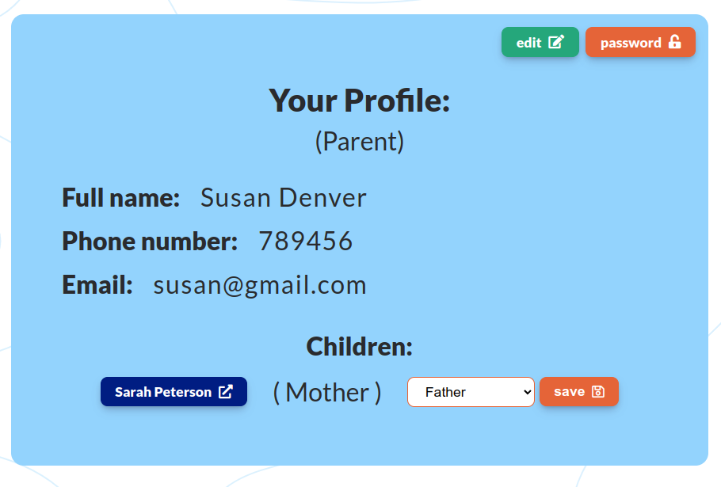

When the user clicks on the button "Edit", the dropdown menu appears, where she or he may choose the relation to their children:

Types of the relation:

- Mother;
- Father;
- Grandmother;
- Grandfather;
- Other.

  

After choosing and clicking the save button, the relation will be assigned.

  

If the user is a teacher, the profile has a following look:

  

There is additional data on the classes given to the students underneath the profile box.

  

This box is only visible to the teacher and the bosses.

In this box, there are date pickers, which allow the teacher or the boss to sort classes during a particular period.

  

Here the teacher or the boss will be able to pick data, and the summary of the classes will be displayed.

Needless to say, the pagination functionality has been implemented in case there are more than 20 classes.

  

The buttons for the page navigation have different appearances to guide the user on whether there are more classes or not.

  :

If the user is a Sales Manager, the profile has a following look:

  

It has two addition sections: Students for which this sales manager is in charge (visible to all users) and "Sales made" (visible to the sales manager her/himself and the boss)

  

The "Students" section has a table with the students that this sales manager is in charge of.

  

There the sales manager or the user can see all students. Moreover, the students whose parents should be contacted urgently have an orange label to make them more distinguishable.

  

Underneath the "Students" section, there is a table with the "Sales made" by the sales manager.

  

It has a header with the total amount of sales made by the sales manager and a link to the sales page, where the whole statistics are stored.

  

Under the header, there are recent sales made with limited data (the date on which the sale was made and the number of classes sold). Since the pagination functionality has been implemented, there are only 20 recent sales could be seen, and there are two buttons for the page navigation at the bottom of the table.

  

**Edit profile page**

  

It has a container where the user can edit:

- First Name;
- Last Name;
- Phone Number;

There are three fields with prefilled data for the user. The user could change this data if he/she wants.

  

Underneath the fields, there are two buttons, "Go Back" and "Save." If the user doesn't want to save changes, they can click on the "Go Back" button and will be redirected to the profile page. If the user wants to save changes, they can click on the "Save" button and will be redirected to the profile page.

  

**Profile Delete Page**

  

Only the bosses have access to this page as only they are able to delete any profile.

This page has a box with a warning message and a link to the profile page of the user that is about to be deleted:

  

There are two buttons under the warning message, there are two buttons, "Cancel" and "Delete". If the user doesn't want to delete the profile, he/she can click on the "Cancel" button and will be redirected to the profile page. If the user wants to delete the profile, he/she can click on the "Delete" button and will be redirected to the profile page, and the school member will be permanently deleted.

  

**Profile Change Password Page**

  

It has a header with the title "Change Password" and a subtitle to guide the user on what to do next. Underneath, there are three field to be filled:

- Old Password;
- New Password;
- Confirm New Password.

  

If there are any errors in the fields, the user will see the error message.

Under the fields, there are two buttons, "Go Back" and "Submit". If the user doesn't want to change the password, he/she can click on the "Go Back" button and will be redirected to the profile page. If the user wants to change the password, he/she can click on the "Change Password" button and will be redirected to the profile page, and the password will be changed if all conditions are met.

  

**New Applications Page**

This page is only visible to the boss and sales manager.
  


This page has a title and the number of the new applications left.

  

It also has a table with the new applications, where each application has a link. After clicking on the application in a table, the user will be redirected to the application detail page.

  

Underneath the table, there are navigation buttons. If the user wants to see the next page of the application, he/she can click on the "Next" button. If the user wants to see the previous page of the applications, he/she can click on the "Previous" button.

  
  

**Application Detail Page**

This page is accessible to the boss and sales manager.
For the boss, the page has the following look:

  

It has two boxes. The first box consists of the information about the applicant, including the name, the email, and the phone number.

  

It also has a "Delete" button in the top right corner of the page. If the boss wants to delete the application, he/she can click on the "Delete" button and will be redirected to the delete application page.

  

The second box provides the boss with the assigning role functionality, which will give access to the applicant to the application according to the role the boss assigns.

  

When the boss clicks on the dropdown menu, the following choices will be shown:

  

After choosing the role the boss wants to assign, he/she can click on the "Save" button.

  

When the boss clicks on "Save" button, the role will be assigned to the applicant. However, it will not redirect the boss to any page in order to prevent the boss from accidentally assigning the wrong role to an applicant.

To go back to the applications page, the boss may click on the link underneath the boxes "Go to other applications". And the user will be redirected to the applications page.

  

For the sales manager, the page has the following look:

  

The page has no "Delete" button as it is not accessible to the sales manager. Moreover, the page has no box with the assigning role to the new applicant as it is accessible only to the boss.

**Application Delete Page**

  

This page is only accessible to the boss. Thus, only the boss is empowered to delete any applications.
It has a warning message with the applicant's name.

  

It also has 2 buttons, "Go Back" and "Delete". If the boss doesn't want to delete the application, he/she can click on "Go Back" button and will be redirected to the application detail page. If the boss wants to delete the application, he/she can click on "Delete" button. He / she will be redirected to the new applications page, and the application will be permanently deleted.

  

**Limited Access Page**

  

This page applies to the users that are not allowed to access the page that they want to enter manually in the address bar. it has a box with a friendly message pointing out that the user has no access to a particular page. It also has a link to the user's profile page.


  

**Sales Page**

This page is accessible only by the sales manager and the boss. However, the look of the page is different for the boss and the sales manager as the boss has no access to add, edit or delete salez.

For the sales managers, the sales page looks as follows:

  

It has a button "Add new sale" in the top right corner of the page. If the sales manager wants to add a new sale, he/she can click on the "Add new sale" button and will be redirected to the add new sale page.

  

It has the title "Sales", datepicker sorting bar, and a table with the sales.

The sorting bar has 2 datepickers, one for the start date and one for the end date. The sales are sorted by the start date. There is a button "Search" on the right side of the sorting bar. after picking dates and clicking on the "Search" button, the sales will be filtered by the dates.

  

Under the sorting bar, there is the summary of sales found:

  

The table has the following columns:

- ID of the sale;
- Date of the sale;
- Total amount of classes sold;
- Manager, who conducted the sale (with the link to the personal profile);
- Client, who bought the classes (with the link to the personal profile);
- Student for whom the classes were bought (with the link to the personal profile);
- Edit, which will redirect the sales manager to the edit sale page;
- Delete, which will redirect the sales manager to the delete sale page.

  

As it is shown in the picture, only the sales manager, who conducted the sale, is able to edit or delete the sale. The user in the picture is Annie Green, and only she is able to edit or delete the sale which she conducted. She has no access to render or delete the sales made by another Sales Manager, Kate Peterson.

Under the table, there is a navigation bar for the table. It has a "Previous" button and a "Next" button. The "Previous" button will redirect the sales manager to the previous page of the table. The "Next" button will redirect the sales manager to the next page of the table.

  
  

On the mobile screens, the table has only the following columns:

- ID of the sale;
- Date of the sale;
- Total amount of classes sold;
- Edit, which will redirect the sales manager to the edit sale page;
- Delete, redirecting the sales manager to the delete sale page.

  

It also has a friendly message, which will suggest that the user open the sales on the page to view the complete data on sales on the broader devices.

Additionally, the sales page has a different look for the boss. It has no "Add new sale" button in the top right corner of the page. It has "Edit" and "Delete" columns as only sales managers can edit or delete their sales.

  

**Add New Sale Page**

This page is accessible only by the sales manager.

  

 It has the title "Add New Sale" and a form with the following fields:

   

- Client Name (with dropdown menu, where all clients are listed);
- Amount (for the number of classes that the client is buying);
- Student (with dropdown menu, where all students are listed);

When a Sales Manager clicks on the "Client Name" dropdown menu, it will show all the clients with an option to type a name for a search:

  

When a Sales Manager clicks on the "Student" dropdown menu, it will show all the students with an option to type a name for a search:

  

Underneath the form, there is a button "Save" and a button "Cancel". If the sales manager clicks on the "Save" button, the form will be validated, and if it is valid, the sale will be added to the database. If the form is not valid, the user will be redirected to the same page, and the form will be filled with the data that was entered before. If the sales manager clicks on the "Cancel" button, he/she will be redirected to the sales page.

  

**Edit Sale Page**

This page is accessible only by the sales manager.

  

 It has the title "Edit Sale" and a form with the following fields with pre-filled data:

  

The dropdown menus are pre-filled with the data from the sale that is being edited, and the previously chosen client is highlighted with the orange background. The same comes to the dropdown menus for the students.

  

Under the fields, there are two buttons: "Save" and "Cancel." If the sales manager clicks on the "Save" button, the form will be validated, and if it is valid, the sale will be updated in the database. If the form is not valid, the user will be redirected to the same page, and the form will be filled with the data that was entered before. If the sales manager clicks on the "Cancel" button, he/she will be redirected to the sales page.

  

**Delete Sale Page**

This page is accessible only by the sales manager.

  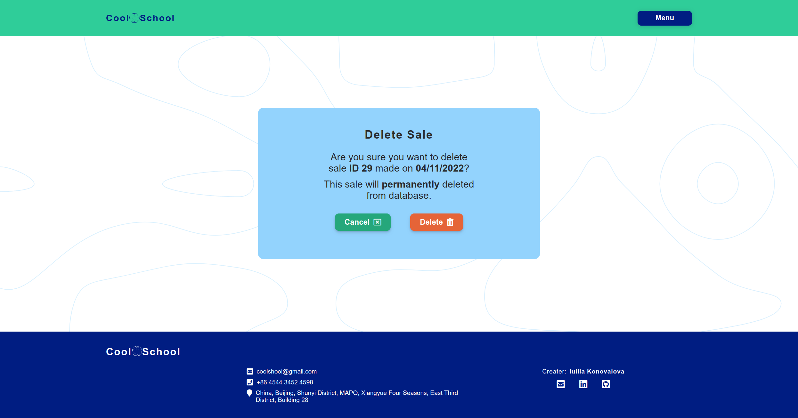

 It has the title "Delete Sale" and a warning message with info og the sale that is about to be deleted.

  

Under the warning message there are 2 buttons: "Delete" and "Cancel". If the sales manager clicks on the "Delete" button, the sale will be deleted from the database. If the sales manager clicks on the "Cancel" button, he/she will be redirected to the sales page.

  

**MembersPage**

This page is accessible only by the school personnel (bosses, teachers, sales managers, receptionists).

  

  It has the title "Members" and a sorting bar. The sorting bar has the following choices:

- All Members;
- Parents;
- Teachers;
- Sales Managers;
- Receptionists;

  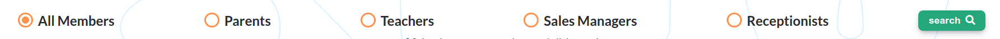

When the user clicks on the "All Members" button, the table will be sorted by the name of the member. When the user clicks on the "Parents" button, the table will be sorted by the name of the parent. When the user clicks on the "Teachers" button, the table will be sorted by the name of the teacher. When the user clicks on the "Sales Managers" button, the table will be sorted by the name of the sales manager. When the user clicks on the "Receptionists" button, the table will be sorted by the name of the receptionist.

It also displays the amount of the sorting results:

  

There is also a search bar with the instructions:

  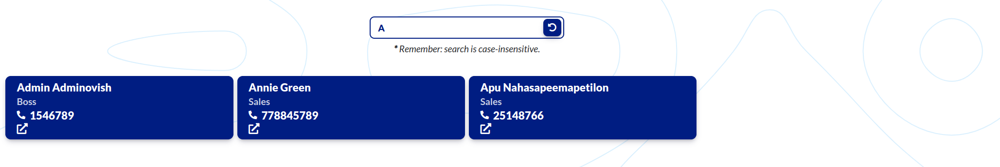

When the user inputs the name of the member, the search bar will show the amount of the results.
  
  

In the table results, the user will see only members which match the input:

  

  
Then the redo button will be displayed. When the user clicks on the redo button, the search bar will be cleared, and the table will be sorted by the name of the member.

  


Underneath, there is a table of the results. It has links to the pages of each member.

Under the table, there is a navigation bar for the table. It has a "Previous" button and a "Next" button. The "Previous" button will redirect the sales manager to the previous page of the table. The "Next" button will redirect the sales manager to the next page of the table.

  
  


**Student Page**

This page is accessible only by the school personnel (bosses, teachers, sales managers, receptionists).

  

There is a button "add new student," which is visible only to sales managers and bosses as only they are empowered to add any students.

  

When the sales manager or a boss clicks on this button, he/she will be redirected to add a new student page.

At the top of the age, there is a title "All Students", and under this title, there is a search bar with instructions underneath this input bar.

  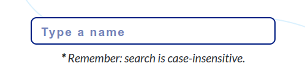

Here the user may type the name in order to find a particular student. As the user starts typing, the undo button appears in the search bar.

  

When the user clicks on the undo button or deletes the input manually, the undo button disappears.

Under the search bar, there is a sorting bar where the user may sort students according to the urgent call needs. It has two options: All students sort and Urgent Class Sort. Plus, there is a search button on the right side. There are also the instructions under the sorting bar.

  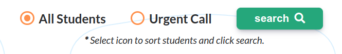

If a student has fewer than ten classes left, this student will have an urgent label on the right side of their name.

  

After all, there is sorting results summary:

  

The following image will display how the urgent sort works:

  

The central part of this page is devoted to the student's table, where all students are displayed. The users can see students' names, urgent call labels, and the link to students' profiles. If the user clicks on the student, he/she will be redirected to this student's profile.

  

  Under the table, there is page navigation. 

Under the table, there is a navigation bar for the table. It has a "Previous" button and a "Next" button. The "Previous" button will redirect the sales manager to the previous page of the table. The "Next" button will redirect the sales manager to the next page of the table.

  
  

The Students Page looks differently for teachers and receptionists as there is no "add new student" button in the top right corner:

  

**Add student Page**

This page is accessible only by the sales manager and the boss.

  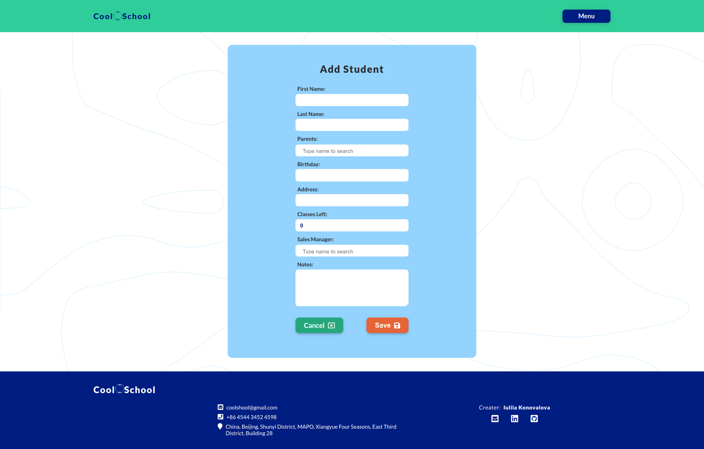

 It has the title "Add Student" and a form with the following fields:

   

- First Name (student's first name);
- Last Name (student's last name);
- Parents (with the list of all clients);

*The user may search by name*

  

*The user may also assign several relatives to a student*

  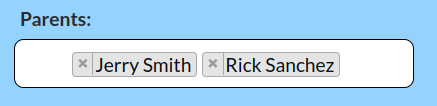

- Birthday (with a date picker functionality);

  

- Address (to store student's address in case of urgent situations);
- Classes Left (if the parents purchased any special offers packages);
- Sales Manager (to assign the sales manager in charge of the student, who will be responsible for keeping close attention to a student's attendance)

  

- Notes (in case, if a student has any preferences or allergies)

Underneath the form, there is a button "Save" and a button "Cancel". If the sales manager or a boss clicks on the "Save" button, the form will be validated and if it is valid, the sale will be added to the database. If the form is not valid, the user will be redirected to the same page, and the form will be filled with the data that was entered before. If the sales manager or a boss clicks on the "Cancel" button, he/she will be redirected to the student's page.

  

**Edit Student Page**

This page is accessible only by the sales manager or the boss.

  

 It has the title "Edit Student's Data" and a form with the following fields with pre-filled data:

  

The fields are pre-filled with the data from the data on the previously selected student. The boss or the sales manager is able to render this data by selecting a particular field and changing data. 

Under the fields, there 2 buttons: "Save" and "Cancel". If the sales manager or the boss clicks on the "Save" button, the form will be validated, and if it is valid, the sale will be updated in the database, and he/she will be redirected to the Student's Detail page. If the form is not valid, the user will be redirected to the same page, and the form will be filled with the data that was entered before. If the sales manager clicks on the "Cancel" button, he/she will be redirected to the Student's Detail page.

  

**Delete Student Page**

This page is accessible only by the sales manager or the boss.

  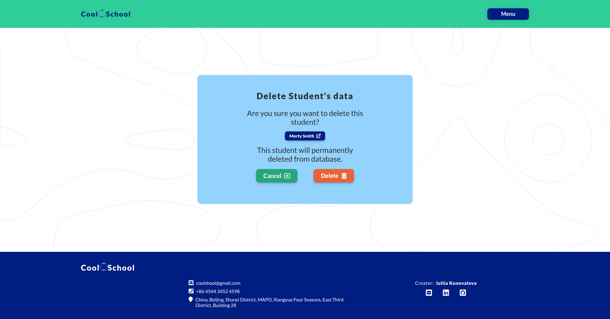

 It has the title "Delete Student's data" and a warning message with the name of the student.

  

The student's name has a link to his/her profile. Thus if the sales manager or a boss wants to open the student's profile, they may directly go to the student's profile.

  

Under the warning message there 2 buttons: "Delete" and "Cancel". If the sales manager clicks on the "Delete" button, the sale will be deleted from the database. If the sales manager clicks on the "Cancel" button, he/she will be redirected to the sales page.

  

**Student Detail Page**

This page is accessible to everyone except potential clients. However, parents can see only their own children's profiles. If they try to enter other students' profiles, they will be redirected to the Access Limitation page.

The page has a following look for the bosses and sales managers:

  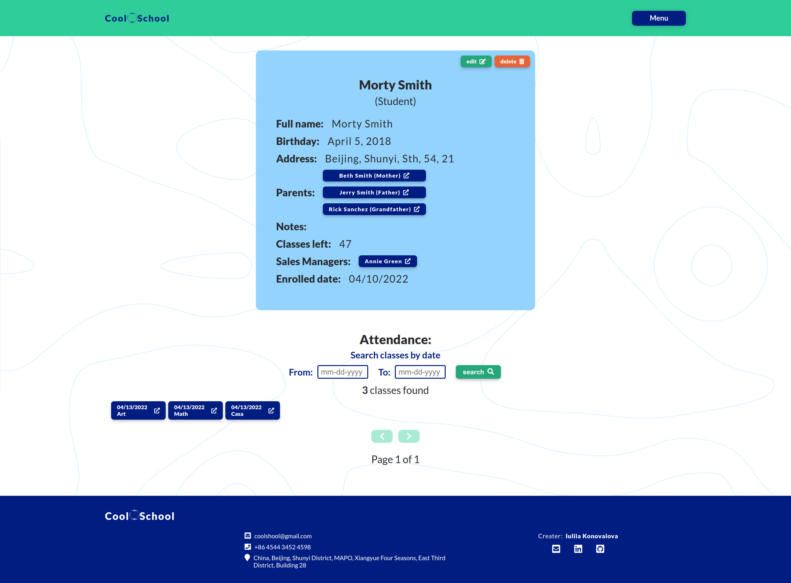

It has additional editing and deletion functionality for the bosses and sales managers. If the user clicks on the "Delete" button, he/she will be redirected to the Student Delete Page. If the user clicks on the "Edit" button, he/she will be redirected to Student Edit Page.

  

For the rest of the users, this page looks as follows:

  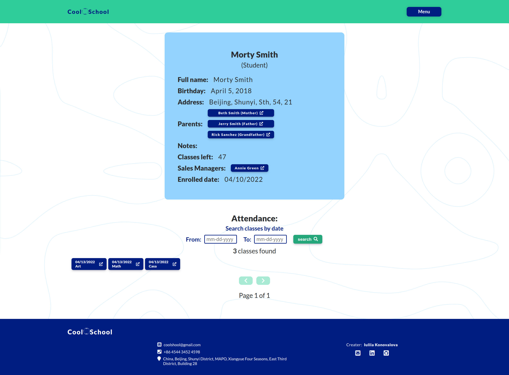

It has a student data box with a student's name as a title and a role underneath the name (Student). If a parent opens his/her child's profile, there will be an additional line pointing that this student is related to the user 

  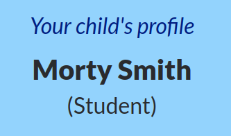

Then the user may see the student's data:

  

- Full Name;
- Birthday;
- Address;
- Parents;

  

  *If the school wants to contact student's relatives, they simply need to click on the parents' link, and they will be redirected to parents' profiles, where they will see their emails and phone numbers data*

- Notes;
- Classes left;
- Sales Manager;

  

- Enrolled date;

Underneath the data box, the user will find the information on the student's attendance.

  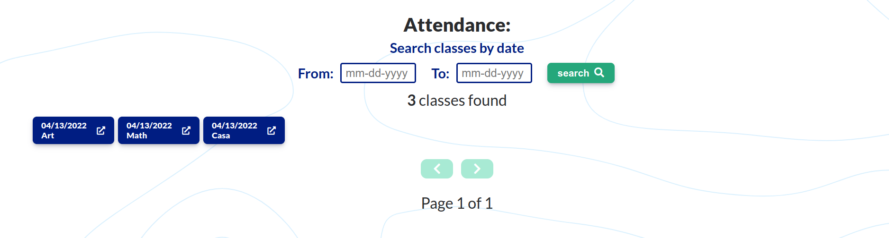

There is sorting by date bar and a search button on the right side of the bar. The sorting bar has 2 datepickers, one for the start date and one for the end date. The sales are sorted by the start date. There is a button "Search" on the right side of the sorting bar. after picking dates and clicking on the "Search" button, the classes will be filtered by the dates. Then the user may see the summary of the results found.

  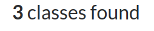

Each class in the attendance section has a date, the name of the subject, and a link to view the class's details. If the user clicks on the class, he/she will be redirected to the class details page.

  

Under the table, there is a navigation bar for the table. It has a "Previous" button and a "Next" button. The "Previous" button will redirect the user to the previous page of the table. The "Next" button will redirect the user to the next page of the table.

  
  

**Schedule Page**

This page is accessible to everyone. 

  

But it has a different look for teachers:

  

It has a "My Schedule Button". If the teacher clicks this button, he/she will be redirected to the personal schedule page.

  


And for the receptionists it will have an additional feature:

  

  It has the button "add lesson". Only receptionists are allowed to make any changes to the schedule.

  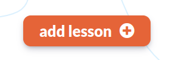

The page has the title "Schedule" and the Line: "Today is ..." for the user to see which day is today. 

  

There is a datepicker for the user to choose a day that the user wants to look into. The calendar is set automatically on today's schedule.
If the user wants to change the day, he/she may click on the date picker, and the calendar will appear.

  

Underneath, there is a schedule table where the time period is on the left side and the classes which were scheduled on the right side. If the user clicks on the class, he/she will be redirected to the lesson detail page.

  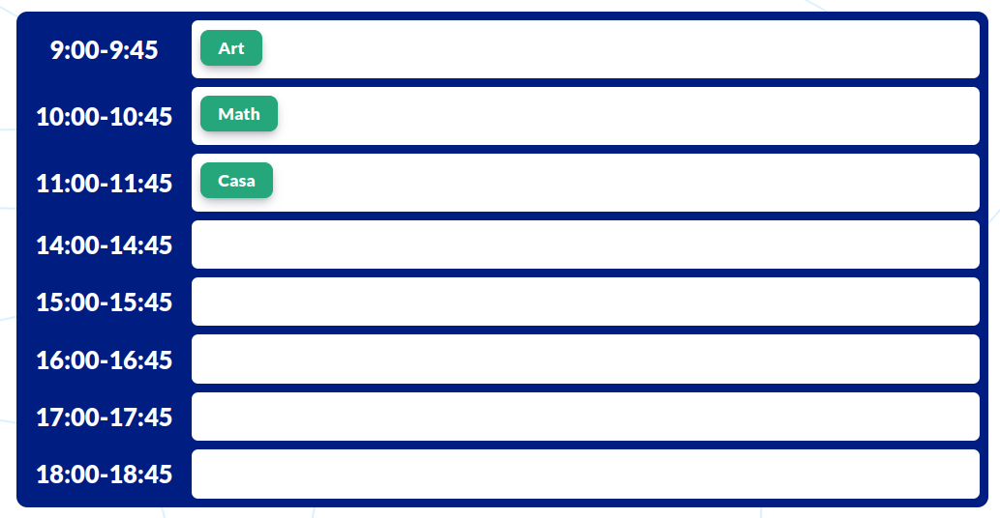

When the user enters the schedule page, it displays the schedule for today's classes.

  

When the user chooses another day, the schedule table will display classes only for that particular day that has been chosen.

  

**Teacher's Personal Schedule Page**

This page is available only to teachers.

  

It has a button in the right top corner - "Back" - to go back to the common schedule page.

  

This schedule will display only the classes of the teacher, which account was entered.

In comparison, here is the common schedule:

  

Here is the teacher's personal schedule:

  

**Add Lesson Page**

This page is accessible only by receptionists as only they have the rights to make any changes in the schedule.

  

It has the title "Adding lesson" and the following fields:

  

- Date (to pick a day on which the class will be given);

  

  *The datepicker functionality was implemented to ease choosing of the day*

- Time Period;

  

*The dropdown menu was implemented to make it easy for the user to choose from available time periods*

- Subject;

  

*The dropdown menu was implemented to make it easy for the user to choose from available subjects*

- Teachers:

  

*The dropdown menu was implemented to make it easy for the user to choose from a list of teachers*

- Students;

  

*The dropdown menu was implemented to make it easy for the user to choose from a list of students*

The field form looks as following:

  

Under the fields there are 2 buttons: "Save" and "Cancel". If the receptionist clicks on the "Save" button, the sale will be added to the database. If the sales manager clicks on the "Cancel" button, he/she will be redirected to the schedule page.

  

**Edit Lesson Page**

This page is accessible only by receptionists as only they have the rights to make any changes in the schedule.

  

 It has the title "Edit Lesson" and a form with the following fields with pre-filled data:

  

The fields are pre-filled with the data from the data on the lesson that had been previously added. The receptionist is able to render this data by selecting a particular field and changing data. 

Under the fields there 2 buttons: "Save" and "Cancel". If the receptionist clicks on the "Save" button, the form will be validated, and if it is valid, the lesson will be updated in the database, and he/she will be redirected to the Lesson's Detail page. If the form is not valid, the user will be redirected to the same page, and the form will be filled with the data that was entered before. If the receptionist clicks on the "Cancel" button, he/she will be redirected to the Lesson's Detail page.

  


**Delete Lesson Page**

This page is accessible only by receptionists as only they have the rights to make changes in the schedule.

  

This page has the title "Lesson Deletion" and a warning message about the permanent deletion of the lesson.

  

Inside this warning message is the link to the lesson that is about to be deleted, so the the receptionist may double check which class he/she wants to delete:

  

Under the warning message, there are 2 buttons "Cancel" and "Delete". If the receptionist doesn't want to delete the lesson, he/she can click on "Cancel" button and will be redirected to the lesson detail page. If the receptionist wants to delete the lesson, he/she can click on "Delete" button, and will be redirected to the schedule page and this lesson will be permanently deleted.

  


**Lesson Detail Page**

This page is accessible by each member of the school.

  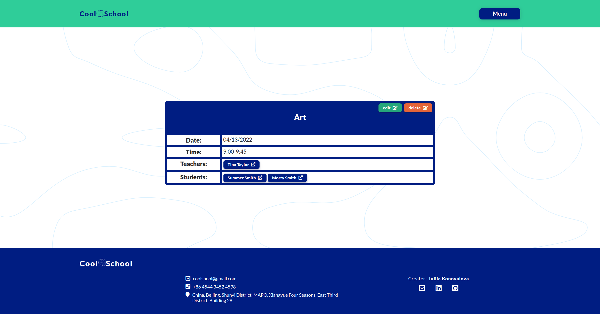

The lesson table has a different look for the users. 

School personnel except receptionists looks as follows:

  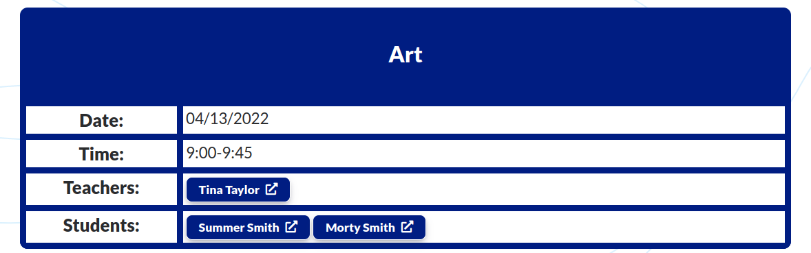

It has the name of the subject as a title:

  

Under the name of the subject, there is a table with the data on the lesson:

  

This table allows users to learn which subject is given, on which day, and in which period of time. This will be beneficial to the users plan their personal schedules.
Moreover, it has a row which shows who is teaching this subject and a row on the students which will attend the class.

However, when it comes to the users, who are parents of potential clients, the table looks a bit differently:

  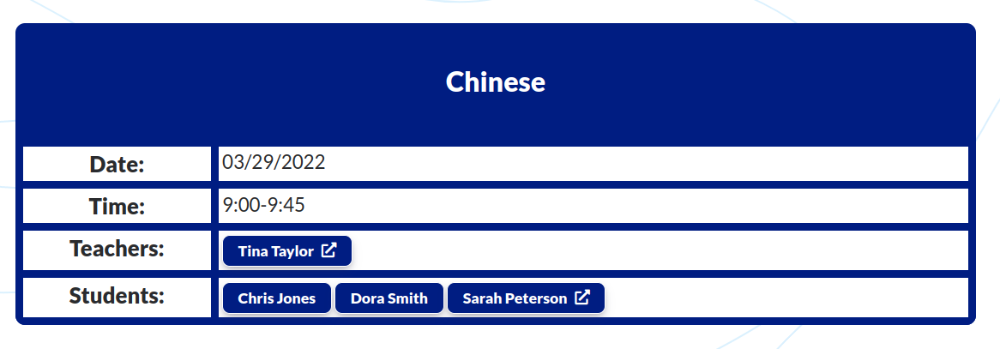

As it may be noticed, a parent may access only their own children's profiles. The rest of the students have no link to this parent.

  

When it comes to the receptionists, they have additional functionality available, and thus, the lesson table looks differently:

  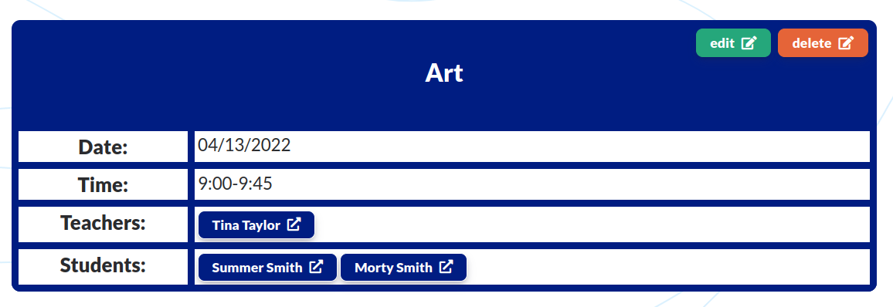

It has 2 button in the top right corner of the table: "edit" and "delete".

  

If the receptionist clicks on the "Delete" button, he/she will be redirected to the Lesson Delete Page. If the user receptionist on the "Edit" button, he/she will be redirected to Lesson Edit Page.

**Error Pages**

There are also 2 additional error pages:

  

  it has a box with the header "Page 404", an image and a short message about the error ("Something went wrong as this page is not found").

  If the user is logged in and tries to access a page that doesn't exist, he/she will find a button with the link to his/her profile page.

  

  If the user is logged out and tries to access a page that doesn't exist, he/she will find a button with the link to the home page

  

  Page 505 is the same as 404 page, but it has a different header ("Page 500") and message ("Something went wrong as there is an internal sever error!").

  

**Favicon**

  

  The favicon is a small image that is displayed in the browser's address bar. It is used to identify the website among others and help the user to find it when he/she is searching for it.

[Back to contents](#contents)

---
## Design

The design of the application is based on the Material Design principles.
The central theme of the application is the simplicity of use. Thus, all the components are designed to be easy to use. The minimalistic approach was used to create something meaningful without moving out of focus. As this application is a multifunctional one and consists of many components, the decision to implement white spaces was made as it helps to create a more pleasant user experience. 

### Color Scheme

The color scheme of the application is based on the bold colors:

  

As it may be noticed, the color scheme is based on the Material Design principles as well. The navbar is green with dark blue text. The background is white with light blue waves, which are almost invisible. There is a dark blue button to guide the user on how to find the menu.
The footer is a dark blue with white text to stand out.

Since the main content has various functions, two different colors were used as the background for the main boxes. The first one is #001D82, which is the color of the navbar text. The decision to use this color for the login/logout/register boxes was made as it shows that the user isn't logged in.
The #93D3FD is the color of the data boxes. This color is consistent with the color scheme throughout the whole application. In addition to this, the blue color is believed to be the preferred color among people and facilitates trust and security.

All buttons except the navbar button are green with the white text editing and cancel functionality and orange for the submission and deletion function.
### Typography

The main font used in the application is Lato. The use of this font is consistent with the color scheme. Needless to say, the Lato font was chosen due to its readability, which increases user experience.

  

  

  

To emphasize the importance of the text, the font-weight was set to 900. To make the accent on the buttons, the font-weight was set to 700. For the rest of the text, the font-weight was set to 400.

### Imagery

- The main background image was generated with the user of the [BGJar](https://www.bgjar.com/) tool. The image was generated with the following settings:

  

To generate this particular pattern, I used Contour Line Generator with white background and #93D3FD54 as the color of the lines. 

- Images were downloaded from the [icons8](https://icons8.com/) website only for the home page. However, the original images were changed manually to match the color scheme.

- The main part is allocated to the use of icons from the [font awesome](https://fontawesome.com/) website. The use of icons is essential for the user experience when it comes to multifunctional websites.


### Wireframes

- [Desktop Wireframes](documentation/wireframes/pp4_desktop.pdf)
- [Tablet Wireframes](documentation/wireframes/pp4_tablet.pdf)
- [Mobile Wireframes](documentation/wireframes/pp4_mobile.pdf)

[Back to contents](#contents)

---

## Flowcharts

This application is aimed at users with different roles to fulfill their expectations and provide all functionality.

The following flowcharts were created to help to understand the application and its functionality.

The flowcharts were created using [Draw.io](https://www.lucidchart.com/).

- [Flowchart for Bosses](documentation/flowcharts/flowchart_boss.pdf)
- [Flowchart for Sales Managers](documentation/flowcharts/flowchart_sales.pdf)
- [Flowchart for Parents](documentation/flowcharts/flowchart_parent.pdf)
- [Flowchart for Teachers](documentation/flowcharts/flowchart_teachers.pdf)
- [Flowchart for Receptionist](documentation/flowcharts/flowchart_receptionist.pdf)

[Back to contents](#contents)

---

## Information Architecture

### Database

* During the earliest stages of the project, the database was created using SQLite.
* The database was then migrated to PostgreSQL.

### Entity-Relationship Diagram

* The ERD was created using [Draw.io](https://www.lucidchart.com/).

- [Database Scheme](documentation/diagrams/db_final.pdf)

### Data Modeling

1. **CustomUser**

Extends Allauth's User model.

| Name          | Database Key  | Field Type    | Validation |
| ------------- | ------------- | ------------- | ---------- |
| UserName      | username      | CharField     |  max_length=50, blank=False, null=True, unique=True    |
| Email         | email         | EmailField    | max_length=50, unique=True, blank=False, null=False    |
| First Name    | first_name    | CharField     | max_length=30, blank=False, null=False    |
| Last Name     | last_name     | CharField     | max_length=30, blank=False, null=False    |
| Phone Number  | email         | CharField     | max_length=30, blank=False, null=False    |
| Role          | phone         | IntegerField  | choices=ROLES, default=5    |


```Python
    # Roles to assign to users
    ROLES = (
        (0, 'boss'),
        (1, 'teacher'),
        (2, 'sales'),
        (3, 'receptionist'),
        (4, 'parent'),
        (5, 'potential user'),
    )
```

2. **Teacher**

It was created in order to provide more room for manipulation of the database and provide opportunities for future developments. Users with the role of teacher will be automatically assigned to this table.

| Name          | Database Key  | Field Type    | Validation |
| ------------- | ------------- | ------------- | ---------- |
| Teacher       | user          | ForeignKey    |  CustomUser, on_delete=models.CASCADE  |

3. **Receptionist**

It was created in order to provide more room for manipulation of the database and provide opportunities for future developments.

| Name          | Database Key  | Field Type    | Validation |
| ------------- | ------------- | ------------- | ---------- |
| Receptionist  | user          | ForeignKey    |  CustomUser, on_delete=models.CASCADE  |

4. **SalesManager**

It was created in order to provide more room for manipulation of the database and provide opportunities for future developments. Users with the role of sales manager will be automatically assigned to this table.

| Name          | Database Key  | Field Type    | Validation |
| ------------- | ------------- | ------------- | ---------- |
| Sales Manager | user          | ForeignKey    |  CustomUser, on_delete=models.CASCADE  |
| Sales Total   | total_sold    | IntegerField  |  default=0, blank=True, null=True  |

5. **Parent**

It was created in order to provide more room for manipulation of the database and provide opportunities for future developments. Users with the role of the parent will be automatically assigned to this table.

| Name          | Database Key  | Field Type    | Validation |
| ------------- | ------------- | ------------- | ---------- |
| Sales Manager | user          | ForeignKey    |  CustomUser, on_delete=models.CASCADE  |
| Relation to a student  | relation      | IntegerField  |  choices=GUARDIAN_RELATION, default=5  |

```Python
    # Guardian's relation to the student
    GUARDIAN_RELATION = (
        (1, 'father'),
        (2, 'mother'),
        (3, 'grandfather'),
        (4, 'grandmother'),
        (5, 'other'),
    )
```
6. **Student**

This table does not inherit from the CustomUser model. This is because the students are not users. Instead, they are the main table of the application.

| Name          | Database Key  | Field Type    | Validation |
| ------------- | ------------- | ------------- | ---------- |
| First Name         | first_name    | CharField       | max_length=50, blank=False, null=False    |
| Last Name          | last_name     | CharField       | max_length=50, blank=False, null=False    |
| Parents            | parent        | ManyToManyField | Parent, related_name='child'  |
| Birthday           | birthday      | DateField       |          |
| Address            | address       | CharField       | max_length=100, blank=True, null=True |
| Date of enrollment | enrolled      | DateTimeField   | auto_now_add=True    |
| Classes left       | classes_left  | IntegerField    | default=0, blank=True, null=True    |
| Sales Manager      | sales_manager | ManyToManyField | SalesManager, related_name='student'    |
| Notes              | notes         | TextField       | blank=True    |

7. **Sales**

This table is needed to conduct sales operations. It controls the sales of the products. It also adds classes to a particular student and adds total classes sold to a sales manager. A separate field "student_id" was added in order to prevent a circular import but allow sales to be in control of classes added to a particular student or reduced (For example, when parents ask for a refund).

| Name          | Database Key  | Field Type    | Validation |
| ------------- | ------------- | ------------- | ---------- |
| Sales Manager | sold_by       | ForeignKey    | SalesManager, on_delete=models.CASCADE, related_name='sold'   |
| Client(Parent)| sold_to       | ForeignKey    | Parent, on_delete=models.CASCADE, related_name='bought'   |
| Classes Number| amount        | IntegerField  |            |
| Date of Sale  | date          | DateTimeField | auto_now_add=True    |
| Student       | amount        | IntegerField  |  default=0          |

8. **Lesson**

This table is necessary to control the lessons and provide data for the schedule.

| Name          | Database Key  | Field Type     | Validation |
| ------------- | ------------- | -------------- | ---------- |
| Class's Date  | date          | DateField      |            |
| Class's Time  | time          | IntegerField   | choices=TIME_PERIODS, default=0 |
| Subject       | subject       | IntegerField   | choices=SUBJECTS, default=1     |
| Teachers      | teachers      | ManyToManyField| Teacher, related_name='lessons' |
| Students      | students      | ManyToManyField| Student, related_name='lessons' |


```Python
    # Time periods variations
    TIME_PERIODS = (
        (0, '9:00-9:45'),
        (1, '10:00-10:45'),
        (2, '11:00-11:45'),
        (3, '14:00-14:45'),
        (4, '15:00-15:45'),
        (5, '16:00-16:45'),
        (6, '17:00-17:45'),
        (7, '18:00-18:45'),
    )

    # Subject variations
    SUBJECTS = (
        (1, 'art'),
        (2, 'math'),
        (3, 'casa'),
        (4, 'chinese'),
        (5, 'toddlers'),
        (6, 'music'),
        (7, 'english'),
        (8, 'sport'),
        (9, 'cooking'),
        (10, 'infants'),
    )
```


[Back to contents](#contents)

---
## Testing

Please refer to the [TESTING.md](TESTING.md) file for all test-related documentation.

[Back to contents](#contents)

---

## Deployment

- The app was deployed to [Heroku](https://heroku.com).
- The app can be reached by the [link](https://issue-tracker-by-konovalovs.herokuapp.com/)
### Local deployment

*Note:*
  - This project requires to install all the requirements:
  - Open the terminal window and type:
  - `pip3 install -r requirements.txt`

Create a local copy of the GitHub repository by following one of the two processes below:

- Download ZIP file:
  1. Go to the [GitHub Repo page](https://github.com/IuliiaKonovalova/issue_tracker).
  1. Click the Code button and download the ZIP file containing the project.
  1. Extract the ZIP file to a location on your PC.

- Clone the repository:
  1. Open a folder on your computer with the terminal.
  1. Run the following command
  - `git clone https://github.com/IuliiaKonovalova/issue_tracker.git`

- Alternatively, if using Gitpod, you can click below to create your own workspace using this repository.

  [](https://gitpod.io/#https://github.com/IuliiaKonovalova/issue_tracker)

---

1. Install the dependencies:

    - Open the terminal window and type:
    - `pip3 install -r requirements.txt`


1. Create a `.gitignore` file in the root directory of the project where you should add env.py and __pycache__ files to prevent the privacy of your secret data.

1. Create a `.env` file. This will contain the following environment variables:

    ```python
    import os

      os.environ['SECRET_KEY'] = 'Add a secret key'
      os.environ['DATABASE_URL'] = 'will be used to connect to the database'
      os.environ['DEBUG'] = 'True'
    ```

    *During the development stage DEBUG is set to True, but it is vital to change it to False.*

1. Run the following commands in a terminal to make migrations: 
    - `python3 manage.py makemigrations`
    - `python3 manage.py migrate`
1. Create a superuser to get access to the admin environment.
    - `python3 manage.py createsuperuser`
    - Enter the required information (your username, email and password).
1. Run the app with the following command in the terminal:
    - `python3 manage.py runserver`
1. Open the link provided in a browser to see the app.

1. If you need to access the admin page:
    - Add /admin/ to the link provided.
    - Enter your username and password (for the superuser that you have created before).
    - You will be redirected to the admin page.


### Heroku Deployment

* Set up a local workspace on your computer for Heroku:
    - Create a list of requirements that the project needs to run:
      - type this in the terminal: `pip3 freeze > requirements.txt`
    - Commit and push the changes to GitHub
    
* Go to [www.heroku.com](www.heroku.com) 
* Log in or create a Heroku account.
* Create a new app with any unique name <name app>.

  

* Create a Procfile in your local workplace:

  
    
    This file will will contain the following:
    ```python
        web: gunicorn <name app>.wsgi:application
    ```
    - Commit and push the changes to GitHub.

* Go to resources in Heroku and search for postgresql. Select Hobby dev - Free and click on the provision button to add it to the project.

  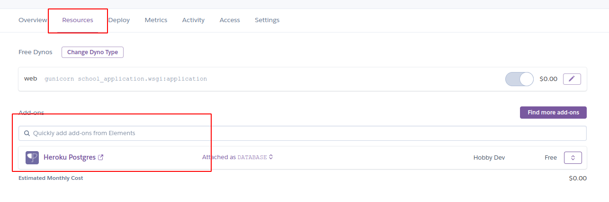

* Go to the settings app in Heroku and go to Config Vars.

  

Click on Reveal Config Vars and add the following config variables:

| Key      | Value          |
|-------------|-------------|
| DATABASE_URL | ... | 
| DISABLE_COLLECTSTATIC | 1 |
| EMAIL_HOST_PASS | ... |
| EMAIL_HOST_USER | ... |
| HEROKU_HOSTNAME | ... |
| SECRET_KEY | ... |


* Copy the value of DATABASE_URL and input it into the .env file and generate a secret key (you may use [Djecrety](https://djecrety.ir/) for secret key generation).
* Create EMAIL_HOST_PASS and EMAIL_HOST_USER with a gmail account and add values to these keys.
* Migrate changes.
* Set debug to False in settings.py
* Commit and push the changes to GitHub.
* Connect your repository to Heroku.

  

* Deploy the app to Heroku by clicking "Deploy Branch" button. If you want to enable auto-deployment, click "Enable Automatic Deployment".

   


The deployment process will start.

   

Click "View build logs" to see the progress of the deployment.

  


*Due to security updates, Heroku dashboard will not allow you to deploy your app from GitHub. Thus, you need to run the following commands in your terminal:*

| action | terminal command | comment |
| ------ | ---------------- | ------- |
| login to your heroku account | `heroku login -i` | |
| create a new app on heroku | `heroku create NAME-OF-YOUR-APP` | if you haven't created the app before, and then, you can access the app via the Heroku dashboard and set up your config vars.|
| add remote to your local repository | `heroku git:remote -a NAME-OF-YOUR-APP` | if you have already created app on Heroku (before the security updates) and connected it using Heroku dashboard |
| deploy new version of the app | `git push heroku main` | |
| rename app | `git remote rename NAME-OF-YOUR-APP NAME-OF-YOUR-APP-2` | |

**Final Deployment**

* Set debug to False locally + delete DISABLE_COLLECTSTATIC from config vars in Heroku dashboard.
* Commit and push the changes to GitHub.

[Back to contents](#contents)
---

## Credits

- [GitHub](https://github.com/) for giving the idea of the project's design.
- [Django](https://www.djangoproject.com/) for the framework.
- [BGJar](https://www.bgjar.com/): for the free access to the background images build tool.
- [Font awesome](https://fontawesome.com/): for the free access to icons.
- [Heroku](https://www.heroku.com/): for the free hosting of the website.
- [jQuery](https://jquery.com/): for providing varieties of tools to make standard HTML code look appealing.
- [Coolors](https://coolors.co/): for providing a free platform to generate your own palette.
- [Icons8](https://icons8.com/): for providing free access to amazing icons and illustrations.
- [Postgresql](https://www.postgresql.org/): for providing a free database.
- [Codemy.com](https://www.youtube.com/watch?v=N-PB-HMFmdo): for providing a free video on how to implement pagination in the project.
- [Responsive Viewer](https://chrome.google.com/webstore/detail/responsive-viewer/inmopeiepgfljkpkidclfgbgbmfcennb/related?hl=en): for providing a free platform to test website responsiveness
- [GoFullPage](chrome://extensions/?id=fdpohaocaechififmbbbbbknoalclacl): for allowing to create free full web page screenshots;
- [Favicon Generator. For real.](https://realfavicongenerator.net/): for providing a free platform to generate favicons.

*All names are fictional (the majority of the names were taken from "The Simpsons" and "Rick and Morty" cartoons), and any resemblance to actual events or locales or persons, living or dead, is entirely coincidental.*

[Back to contents](#contents)
---

## Acknowledgments


- [Tim Nelson](https://github.com/TravelTimN) was a great supporter of my bold idea of a project. Tim helped me to understand the concept of a database for the school app and greatly motivated me to do my best throughout the whole development stage.
- [Aleksei Konovalov](https://github.com/lexach91), my husband and coding partner, who assisted me greatly in understanding AJAX implementation and helped me to stay sane.
- My current workplace for providing me with the main idea for the project and incentivizing me to work on it.


[Back to contents](#contents)