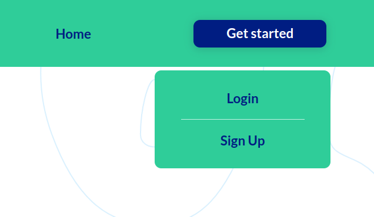
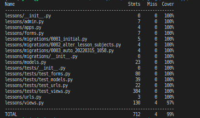
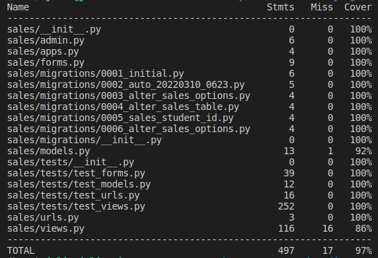

# Testing

## Manual Testing

Testing was done throughout site development, for each feature before it was merged into the master file.

Usability was tested with the below user acceptance testing, sent to new users to ensure testing from different users, on different devices and browsers to ensure issues were caught and where possible fixed during development.


|     | User Actions           | Expected Results | Y/N | Comments    |
|-------------|------------------------|------------------|------|-------------|
| Sign Up     |                        |                  |      |             |
| 1           | Click on the Get started button | Dropdown menu with 2 options: Login/SignUp | Y |          |
| 2           | Click on Sign Up button | Redirection to Sign Up page | Y |          |
| 3           | Click Get Started button in the hero section | Redirection to Sign Up page | Y |          |
| 4           | Click on the Login link in the form | Redirection to Login page | Y |          |
| 5           | Enter valid email | Field will only accept email address format | Y |          |
| 6           | Enter valid username | Field will only accept no more than 50 characters | Y |          |
| 7           | Enter valid First Name | Field will only accept no more than 30 characters | Y |          |
| 8           | Enter valid Last Name | Field will only accept no more than 30 characters | Y |          |
| 9           | Enter valid phone number | Field will only accept no more than 30 characters | Y |          |
| 10          | Enter valid password | Field will only accept secure passwords | Y |          |
| 11          | Enter valid password confirmation | Field will only accept the same password from the previous field | Y |          |
| 12          | Click on the Sign Up button | Takes user to confirm email page Sends address a confirmation request email | Y |          |
| 13          | Confirm email | Redirects user to blank Sign In page | Y |          |
| 14          | Sign In with the same email/username and password | Takes user to schedule page with pop-up confirming successful sign in. Get started button now missing in main nav, replaced by Menu | Y |          |
| 15          | Click "Menu", choose "Logout" | Takes user to log out page to confirm logout | Y |          |
| 16          | Click "Logout" button  in the center of the page| Redirects user to home page | Y |          |
| 17          | Click browser back button | You are still logged out | Y |          |
| Log In      |                        |                  |      |             |
| 1           | Click on the Get started button | Dropdown menu with 2 options: Login/SignUp | Y |          |
| 2           | Click on Login button | Redirection to Login page | Y |          |
| 3           | Click on the SignUp link in the form | Redirection to SignUp page | Y |          |
| 4           | Enter valid email or username | Field will only accept email address format | Y |          |
| 5           | Enter valid password | Field will only accept secure passwords | Y |          |
| 6           | Click on the Sign In button | Takes user to schedule page with pop-up confirming successful sign in. Get started button now missing in main nav, replaced by Menu | Y |          |
| 7           | Clicks "Forgot Password" instead of "Sign In" | Redirects user to forgot password page | Y |          |
| 8           | Click "Menu", choose "Logout" | Takes user to log out page to confirm logout | Y |          |
| 9           | Click "Logout" button  in the center of the page| Redirects user to home page | Y |          |
| 10          | Click browser back button | You are still logged out | Y |          |
| Menu        |                        |                  |      |             |
| 1           | Click on the "Menu" button | Dropdown menu with 2-7 options depending on the user's role | Y | Available to everyone |
| 2           | Click on "Profile" | Redirection to My Profile page | Y | Available to everyone |
| 3           | Click on "New Applications" | Redirection to New Applications page | Y | Available only to bosses and sales managers |
| 4           | Click on "Sales" | Redirection to Sales page | Y | Available only to bosses and sales managers |
| 5           | Click on "Members" | Redirection to Members page | Y | Available only to school personnel |
| 6           | Click on "Students" | Redirection to Students page | Y |  Available only to school personnel |
| 7           | Click on "Schedule" | Redirection to Schedule page | Y | Available to everyone |
| 2           | Click on "Logout" button in the center of the page | Takes user to log out page to confirm logout | Y | Available to everyone |
| Profile     |            |                  |      |             |
| 1           |  Click "delete" button | Redirect to delete profile page | Y | Available only to bosses  |
| 2           |  Click "edit" button | Redirect to edit profile page | Y |  Available only when the user opens his/her own profile  |
| 3           |  Click "password" button | Takes user to change password page to confirm logout | Y |  Available only when the user opens his/her own profile |
| 4           |  Click "child's name" button | Takes user to change email page to confirm logout | Y | Available only to the parents whose kids are saved in the school system |
| 5           |  Click "edit" button in the relation section | Opens dropdown menu with options: mother, father, grandmother, grandfather, other | Y | Available only to the parents whose kids are saved in the school system |
| 6           |  Click on the particular relation | dropdown menu closes and only chosen relation is seen | Y | Available only to the parents whose kids are saved in the school system |
| 7           |  Click "save" button in the relation section | relation is updated | Y | Available only to the parents whose kids are saved in the school system |
| 8           |  Click "from date calendar" input classes section | calendar picker appear | Y | Available only to the teacher in his/her own profile and the bosses, when the boss enters teacher's profile |
| 9           |  Click "to date calendar" input classes section | calendar picker appear | Y | Available only to the teacher in his/her own profile and the bosses, when the boss enters teacher's profile |
| 10          |  Click "search" button in the classes section when the dates are set | classes are selected | Y | Available only to the teacher in his/her own profile and the bosses, when the boss enters teacher's profile |
| 11          |  Click "class" button in the classes section | redirected to the lesson detail page | Y | Available only to the teacher in his/her own profile and the bosses, when the boss enters teacher's profile |
| 12          |  Click "from date calendar" input sales section | calendar picker appear | Y | Available only to the sales managers in his/her own profile and the bosses, when the boss enters sale mangers's profile |
| 13          |  Click "to date calendar" input sales section | calendar picker appear | Y | Available only to the sales managers in his/her own profile and the bosses, when the boss enters sale mangers's profile |
| 14          |  Click "search" button in the sales section when the dates are set | sales are selected | Y | Available only to the sales managers in his/her own profile and the bosses, when the boss enters sale mangers's profile |
| 15          |  Click "sales" button in the sales section | redirected to the sales detail page | Y | Available only to the sales managers in his/her own profile and the bosses, when the boss enters sale mangers's profile |
| 16          |  Click "student name" button | redirect to the student's profile | Y | Available only to everyone in sales manager profile but parents/potential clients may enter only their own children's profiles|
 17           | Click page navigation buttons | additional sales/classes results will be uploaded | Y | For classes accessible only by the school personnel | 
|Delete Profile |            |                  |      |             |
| 1           |  Click "user name" link | Redirect to the user profile that is about to be deleted | Y | Available only to bosses  |
| 2           |  Click "cancel" button | Redirect back to user profile | Y | Available only to bosses  |
| 3           |  Click "delete" button | Redirect to members page+the user will be deleted from the database | Y | Available only to bosses  |
| Edit Profile |            |                  |      |             |
| 1           |  Change the form data for the first name, last name, or phone number | Date in the form will be updated | Y | Available only when the user opens his/her own profile  |
| 2           |  Click "cancel" button | Redirect back to user profile | Y |  Available only when the user opens his/her own profile |
| 3           |  Click "save" button | Redirect back to user profile+data will be updated in the database | Y |  Available only when the user opens his/her own profile |
| Change Password |            |                  |      |             |
|1                | Enter valid current password | Field will only accept secure passwords | Y |  Available only when the user opens his/her own profile |
|2                | Enter valid new password | Field will only accept secure passwords | Y |  Available only when the user opens his/her own profile |
|3                | Enter valid new password confirmation | Field will only accept the same password from the previous field | Y |  Available only when the user opens his/her own profile |
|4                | Click "cancel" button | Redirect back to user profile | Y |  Available only when the user opens his/her own profile |
|5                | Click "save" button | Redirect back to user profile+password will be updated | Y |  Available only when the user opens his/her own profile |
| New Applications |     |      |     |    |
| 1                | click on a new application button | Redirect to the application detail page | Y | Available only to bosses and sales managers |
| 2                | page navigation "next" | Redirect to the next page of applications | Y | Available only to bosses and sales managers |
| 3                | page navigation "previous" | Redirect to the previous page of applications | Y | Available only to bosses and sales managers |
| Application Detail |     |      |     |    |
| 1                | click on "delete" button | Redirect to the application detail page+application will be accepted | Y | Available only to bosses |
| 2                | click dropdown menu "potential user" | dropdown menu with user's roles appear | Y | Available only to bosses |
| 3                | click on the particular role | dropdown menu closes and only chosen role is seen | Y | Available only to bosses |
| 4                | click on "accept" button | Redirect to the application detail page+application will be accepted and role will be assigned | Y | Available save to bosses |
| 5                | click on "Go to other application" button | Redirect to the new applications | Y | Available only to bosses and sales managers |
| Sales            |     |      |     |    |
| 1                | click on an "add new sale" button | Redirect to the sales detail page | Y | Available only to sales managers |
| 2                | click on the "from date calendar" input | calendar picker appear | Y | Available only to sales managers and bosses|
| 3                | click on the "to date calendar" input | calendar picker appear | Y | Available only to sales managers and bosses|
| 4                | click on the "search" button | sales are selected | Y | Available only to sales managers and bosses|
| 5                | click on the "sales manager name" button | redirect to the sales manager's profile | Y | Available only to sales managers and bosses|
| 6                | click on the "client name" button | redirect to the client's profile | Y | Available only to sales managers and bosses|
| 7                | click on the "student name" button | redirect to the student's profile | Y | Available only to sales managers and bosses|
| 8                | click on the "edit" button | redirect to the edit sale page | Y | Available only to sales managers, who conducted this sale |
| 9                | click on the "cancel" button | redirect to the sales detail page | Y | Available only to sales managers, who conducted this sale |
| Add Sale         |     |      |     |    |
| 1                | click on the "Client Name" input | dropdown menu with clients appear | Y | Available only to sales managers |
| 2                | click on the "Amount" input | number of classes is available for the input | Y | Available only to sales managers |
| 3                | click on the "Student" input | dropdown menu with students appear | Y | Available only to sales managers |
| 4                | click on the "Cancel" button | redirect to the sales page | Y | Available only to sales managers |
| 5                | click on the "Save" button | redirect to the sales page+sale will be added to the database | Y | Available only to sales managers |
| Edit Sale        |     |      |     |    |
| 1                | click on the "Client Name" input | dropdown menu with clients appear | Y | Available only to sales managers, who conducted this sale |
| 2                | click on the "Amount" input | number of classes is available for the input | Y | Available only to sales managers, who conducted this sale |
| 3                | click on the "Student" input | dropdown menu with students appear | Y | Available only to sales managers, who conducted this sale |
| 4                | click on the "Cancel" button | redirect to the sales page | Y | Available only to sales managers, who conducted this sale |
| 5                | click on the "Save" button | redirect to the sales page+sale will be updated in the database | Y | Available only to sales managers, who conducted this sale |
| Delete Sale      |     |      |     |    |
| 1                | click on the "cancel" button | redirect to the sales page | Y | Available only to sales managers, who conducted this sale |
| 2                | click on the "delete" button | redirect to the sales page+sale will be deleted from the database | Y | Available only to sales managers, who conducted this sale |
| Members          |     |      |     |    |
| 1                | click on the "All members" button + "search" button | all members are displayed | Y | Available only to school staff |
| 2                | click on the "Parents" button + "search" button | only parents are displayed | Y | Available only to school staff |
| 3                | click on the "Teachers" button + "search" button | only teachers are displayed | Y | Available only to school staff |
| 4                | click on the "Sales Managers" button + "search" button | only sales managers are displayed | Y | Available only to school staff |
| 5                | click on the "Receptionists" button + "search" button | only Receptionists are displayed | Y | Available only to school staff |
| 6                | type name in the "search" input | only members with the name are displayed+undo button will appear in the search input | Y | Available only to school staff |
| 7                | click on the "undo" button | all members are displayed | Y | Available only to school staff |
| 8                | click on the "member" box | redirect to member's profile | Y | Available only to school staff |
| 9                | click on the "next" navigation button | redirect to the next page of members | Y | Available only to school staff |
| 10               | click on the "previous" navigation button | redirect to the previous page of members | Y | Available only to school staff |
| Students         |     |      |     |    |
| 1                | type name in the "search" input | only students with the name are displayed+undo button will appear in the search input | Y | Available only to school staff |
| 2                | click on the "undo" button | all students are displayed | Y | Available only to school staff |
| 3                | click on the "All students" button + "search" button | all students are displayed | Y | Available only to school staff |
| 4                | click on the "Urgent Call" button + "search" button | only urgent call students are displayed | Y | Available only to school staff |
| 5                | click on the "student" box | redirect to student's profile | Y | Available only to school staff |
| 6                | click on the "next" navigation button | redirect to the next page of students | Y | Available only to school staff |
| 7                | click on the "previous" navigation button | redirect to the previous page of students | Y | Available only to school staff |
| Add Student      |     |      |     |    |
| 1                | type student's first name in the "first name" input | student's first name is available for the input | Y | Available only to sales managers and bosses |
| 2                | type student's last name in the "last name" input | student's last name is available for the input | Y | Available only to sales managers and bosses |
| 3                | click on the "parents" dropdown menu | dropdown menu with parents' names appear | Y | Available only to sales managers and bosses |
| 4                | click on the parent's name in the "parents" dropdown menu | parent's name is selected | Y | Available only to sales managers and bosses |
| 5                | click on the birthday calendar input | calendar picker appear | Y | Available only to sales managers and bosses |
| 6                | type student's address in the "address" input | student's address is available for the input | Y | Available only to sales managers and bosses |
| 7                | change the number of classes in the "number of classes" input | number of classes is available for the input | Y | Available only to sales managers and bosses |
| 8                | click on the "sales manager" dropdown menu | dropdown menu with sales managers' names appear | Y | Available only to sales managers and bosses |
| 9                | type notes in the "notes" input | notes are available for the input | Y | Available only to sales managers and bosses |
| 10               | click on the "cancel" button | redirect to the students page | Y | Available only to sales managers and bosses |
| 11               | click on the "save" button | redirect to the students page+student will be added to the database | Y | Available only to sales managers and bosses |
| Edit Student     |     |      |     |    |
| 1                | render student's first name in the "first name" input | student's first name is available for the input | Y | Available only to sales managers and bosses, who conducted this sale |
| 2                | render student's last name in the "last name" input | student's last name is available for the input | Y | Available only to sales managers and bosses, who conducted this sale |
| 3                | render the "parents" dropdown menu | dropdown menu with parents' names appear | Y | Available only to sales managers and bosses, who conducted this sale |
| 4                | render the parent's name in the "parents" dropdown menu | parent's name is selected | Y | Available only to sales managers and bosses, who conducted this sale |
| 5                | render the birthday calendar input | calendar picker appear | Y | Available only to sales managers and bosses, who conducted this sale |
| 6                | render student's address in the "address" input | student's address is available for the input | Y | Available only to sales managers and bosses, who conducted this sale |
| 7                | render the number of classes in the "number of classes" input | number of classes is available for the input | Y | Available only to sales managers and bosses, who conducted this sale |
| 8                | render the "sales manager" dropdown menu | dropdown menu with sales managers' names appear | Y | Available only to sales managers and bosses, who conducted this sale |
| 9                | render notes in the "notes" input | notes are available for the input | Y | Available only to sales managers and bosses, who conducted this sale |
| 10               | click on the "cancel" button | redirect to the student detail page | Y | Available only to sales managers and bosses, who conducted this sale |
| 11               | click on the "save" button | redirect to the student detail page+student will be updated in the database | Y | Available only to sales managers and bosses, who conducted this sale |
| Delete Student   |     |      |     |    |
| 1                | click on the "student's name" box | redirect to student's profile | Y | Available only to sales managers and bosses, who conducted this sale |
| 2                | click on the "cancel" button | redirect to the student detail page | Y | Available only to sales managers and bosses, who conducted this sale |
| 3                | click on the "delete" button | redirect to the students page+student will be deleted from the database | Y | Available only to sales managers and bosses, who conducted this sale |
| Student detail   |     |      |     |    |
| 1                | click on the "edit" button | redirect to the edit student page | Y | Available only to sales managers and bosses |
| 2                | click on the "delete" button | redirect to the students page+student will be deleted from the database | Y | Available only to sales managers and bosses |
| 3                | click on the "parent name" button | redirect to the parent's profile | Y | Available only to sales managers and bosses |
| 4                | click on the "sales manager name" button | redirect to the sales manager's profile | Y | Available only to sales managers and bosses |
| 5                | click on "from" calendar input | calendar picker appear | Y | Available only to sales managers and bosses |
| 6                | click on "to" calendar input | calendar picker appear | Y | Available only to sales managers and bosses |
| 7                | click on the "Search" button when the search input is filled | only classes with the subject's names and dates are displayed | Y | Available only to school staff and child's parents |
| 8                | click on the "class" box | redirect to class's profile | Y | Available only to school staff and child's parents |
| 9                | click on the "next" navigation button | redirect to the next page of classes | Y | Available only to school staff and child's parents |
| 10               | click on the "previous" navigation button | redirect to the previous page of classes | Y | Available only to school staff and child's parents |
| Schedule         |     |      |     |    |
| 1                | click on the "add lesson" button | redirect to the add class page | Y | Available only to receptionists |
| 2                | click on the "my schedule" button | redirect to the schedule page for a teacher , which in the session | Y | Available only to teachers |
| 3                | click on the "date" box | calendar picker appear | Y | Available only to teachers |
| 4                | click on the "subject" box | redirect to lesson's detail | Y | Available only to teachers |
| Teacher Schedule    |     |      |     |    |
| 1                | click on the "back" button | redirect to the schedule page | Y | Available only to teacher, who is in session |
| 2                | click on the "subject" box | redirect to lesson's detail | Y | Available only to teachers |
| Lesson detail    |     |      |     |    |
| 1                | click on the "edit" button | redirect to the edit lesson page | Y | Available only to receptionists |
| 2                | click on the "delete" button | redirect to the schedule page+lesson will be deleted from the database | Y | Available only to receptionists |
| 3                | click on the "teacher" button | redirect to the teacher's profile | Y | Available only to everyone |
| 4                | click on the "student" button | redirect to the student's profile | Y | Available only to school staff and parents whose child is |
| Add Lesson       |     |      |     |    |
| 1                | click on the "Date" box | calendar picker appear | Y | Available only to receptionists |
| 2                | click on the "Time Period" dropdown menu | dropdown menu with time periods appear | Y | Available only to receptionists |
| 3               | click on the time in the dropdown menu | time is selected | Y | Available only to receptionists |
| 4                | click on the "Subject" dropdown menu | dropdown menu with subjects appear | Y | Available only to receptionists |
| 5                | click on the subject in the dropdown menu | subject is selected | Y | Available only to receptionists |
| 6                | click on the "Teacher" dropdown menu | dropdown menu with teachers appear | Y | Available only to receptionists |
| 7                | click on the teacher in the dropdown menu | teacher is selected | Y | Available only to receptionists |
| 8                | click on the "Students" dropdown menu | dropdown menu with students appear | Y | Available only to receptionists |
| 9                | click on the student in the dropdown menu | student is selected | Y | Available only to receptionists |
| 10               | click on the "save" button | redirect to the schedule page+lesson will be added to the database | Y | Available only to receptionists |
| 11               | click on the "cancel" button | redirect to the schedule page | Y | Available only to receptionists |
| Edit Lesson      |     |      |     |    |
| 1                | render the "Date" box | calendar picker appear | Y | Available only to receptionists |
| 2                | render the "Time Period" dropdown menu | dropdown menu with time periods appear | Y | Available only to receptionists |
| 3               | render the time in the dropdown menu | time is selected | Y | Available only to receptionists |
| 4                | render the "Subject" dropdown menu | dropdown menu with subjects appear | Y | Available only to receptionists |
| 5                | render the subject in the dropdown menu | subject is selected | Y | Available only to receptionists |
| 6                | render the "Teacher" dropdown menu | dropdown menu with teachers appear | Y | Available only to receptionists |
| 7                | render the teacher in the dropdown menu | teacher is selected | Y | Available only to receptionists |
| 8                | render the "Students" dropdown menu | dropdown menu with students appear | Y | Available only to receptionists |
| 9                | render the student in the dropdown menu | student is selected | Y | Available only to receptionists |
| 10               | click on the "save" button | redirect to the schedule page+lesson will be updated in the database | Y | Available only to receptionists |
| 11               | click on the "cancel" button | redirect to the schedule page | Y | Available only to receptionists |
| Delete Lesson    |     |      |     |    |
| 1                | click on the "Lesson" box | redirect to lesson's detail | Y | Available only to receptionists |
| 2                | click on the "delete" button | redirect to the schedule page+lesson will be deleted from the database | Y | Available only to receptionists |
| 3                | click on the "cancel" button | redirect to the schedule page | Y | Available only to receptionists |

##  Testing User Story

| First Time Visitor Goals | Requirement met | Image |
| ------------------------- | --------------- | ----- |
| As a First Time Visitor, I want to be able to easily understand the main purpose of the app, so that I can learn more about this app. | Welcome text on the top of the homepage explaining the main purpose of the website and describing the the services offered |  |
| As a First Time Visitor, I want to be able to easily navigate through the app, so that I can find the content. | The website for the fist time visitors made out of one page. The user can read all benefits of the school and learn briefly about its services. The page has also several buttons, which lead to the registration page. At the end of the page, the user may find additional contact information and location of the school. |  |
| As a First Time Visitor, I want to be able to register my account, so that I can learn the benefits of the app as a user. | Top navigation GET STARTED button + GET STARTED button in the hero section |  |
| As a First Time Visitor, I want to be able to find the app useful, so that I can use it according to my needs. | The website cover benefits of becoming a member and engages new visitors to become a member of a school | go to features section in the [README.md](README.md) |


## Bugs

### Known bugs:

When the parent, who has 2 or more children, assigns a relation to a child, the relation could be assign only to one child.


However, when the user refreshes the page all children are shown with the correct relation.


### Solved bugs:

There were plenty of bugs during the development process since this project was a learning platform for me and allowed me to improve my skills and knowledge significantly.

However, I tried to solve the majority of them. And one of the bugs that I remember perfectly was related to the extension of the allauth sign up form. I was able to solve it by customizing the allauth sign up form. Moreover, I encountered the problem of making the form work as the migrations were not working. What I have done to migrate the changes is to migrate the profile app first and then perform the rest of the migrations.

Another bug that took me a lot of time to solve was avoiding circular import when I was developing a sales app, as I needed to get not only the client data but also the children's data to add or delete classes from students' profiles. The solution to this problem was to implement the student_id field that will be used to get the children's data and store it in the sales table.
## Automated testing

### Django unit testing

As there are four main apps in the project, we can test them separately.
I knew at the very beginning that I had to implement automated testing. As I was highly concentrated on developing all functionality first, so I left testing to the end. While testing my work, I found several bugs related to the access limited to particular pages and functionality for different roles. In the future, I plan to implement testing and code simultaneously in order to increase my productivity.

**Lessons App**



**Profiles App**


**Sales App**



**Students App**


To run testing, the database must be set to sqlite3.


Thus, you need to comment out the PostgreSQL database settings in the settings.py file and uncomment the sqlite3 database settings.

I set tests folder for each app separately. I also deleted the test.py files from the apps.


While developing tests I was running the following command:

```
python manage.py test <name of the app>
```

To create the coverage report, I ran the following command:

```
coverage run --source=<name of the app> manage.py test
```
```
coverage report
```
To see the html version of the report, I ran the following command:

```
coverage html
```
```
    python3 -m http.server
```
The link to the server will appear. Click the link to see the report and find out which parts of code has not been covered in testing.

### Jest unit testing

I wasn't able to run proper test for the javascript files. I was able to run the tests for the files in the js folder. However, as I was using modern js and target events in my code, jest was not able to run the tests. 


To perform the tests, I created a separate folder outside of the project, where I changed the code to suit the jest standards:

```JavaScript
  if (studentSearchInput) {
    studentSearchInput.addEventListener("keyup", searchStudent);
  }
  if (memberSearchInput) {
    memberSearchInput.addEventListener("keyup", searchMembers);
  }
```

After these changes I was able to run the tests and see the coverage report.

To run the jest tests, I ran the following command:

```
npm init
```
skipped all fields except for the "test command"

```
test: command: jest
```
and confirmed the package.json file.

after that, I run the following command to install jest:


```
npm install --save-dev jest
```
To run test, simply type the following command:

```
npm test
```


## Validation:
### HTML Validation:

- [Full HTML Validation](documentation/validation/html_validation.pdf)

- No errors or warnings were found when passing through the official [W3C](https://validator.w3.org/) validator. This checking was done manually by copying view page source code (Ctrl+U) and pasting it into the validator.

### CSS Validation:

- [Full CSS Validation](documentation/validation/css_validation.png)

- No errors or warnings were found when passing through the official [W3C (Jigsaw)](https://jigsaw.w3.org/css-validator/#validate_by_uri) validator except the warnings about the use of css root variables and webkits for the box-shadow. However, css code works perfectly on various devices. 

### JS Validation:

- [Full JS Validation](documentation/validation/js_validation.png)

- No errors or warning messages were found when passing through the official [JSHint](https://www.jshint.com/) validator. However, the validator has pointed that module variable is not used, but this variable is needed for the automated testing. Needless to say, that as the modern js syntax was used (the Optional Chaining method - `?.`) `/* jshint esversion: 11 */` was added to the top of the file.

### Python Validation:

- [Full Python Validation](documentation/validation/python_validation.pdf)

- No errors were found when the code was passed through Valentin Bryukhanov's [online validation tool](http://pep8online.com/). According to the reports the code is [Pep 8-compliant](https://legacy.python.org/dev/peps/pep-0008/). This checking was done manually by copying python code and pasting it into the validator.